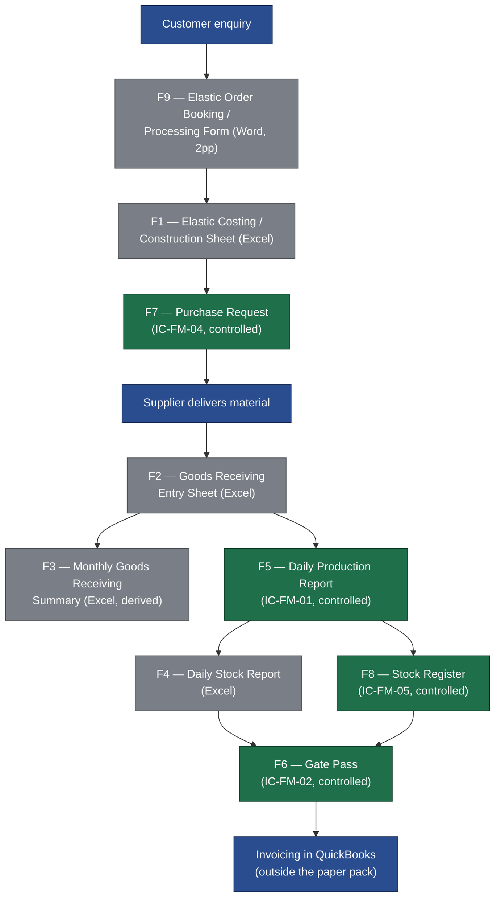

# 01 — Current-State Process Map

**Deliverable A.** The as-is process, derived only from the nine forms in the scanned pack
(`CamScanner 09-08-2026 11.33.pdf`). See [00-README.md](00-README.md) for the status legend used
throughout this file.

---

## 1. End-to-end current flow

Reading the nine forms in the order they are actually used, the paper/Excel system runs as follows:

1. **Customer enquiry** — a customer (e.g. Pakeezah Dyeing & Bleaching) contacts Interconverters,
   through email, phone, or verbally.
2. **F9 — Elastic Order Booking / Processing Form** (Word, 2 pages) captures the customer,
   the product specification, the order quantity, delivery requirements, and an authorisation
   signature that also encodes a QC sampling rule.
3. **F1 — Elastic Costing / Construction Sheet** (Excel) works out the per-metre cost of the
   ordered construction from its yarn/rubber/overhead composition.
4. **F7 — Purchase Request** (Excel/Word print, `IC-FM-04`, controlled) is raised for the raw
   material needed to fulfil the order, and carries a four-level approval chain before a supplier
   order is placed.
5. **F2 — Goods Receiving Entry Sheet** (Excel) logs each vehicle arrival from a supplier, with one
   serial number per vehicle and one line per article received on that vehicle.
6. **F3 — Monthly Goods Receiving Summary** (Excel) is a month-end roll-up of F2, re-derived by
   hand rather than generated from it.
7. **F5 — Daily Production Report** (`IC-FM-01`, controlled) logs, per machine per shift per day,
   what each operator produced, with a REMARKS column doubling as an informal downtime log.
8. **F4 — Daily Stock Report** (Excel) and **F8 — Stock Register** (`IC-FM-05`, controlled) both
   carry the same Opening Stock / Production / Dispatch / Balance columns — F4 as a daily
   all-item snapshot, F8 as a per-product running card.
9. **F6 — Gate Pass** (`IC-FM-02`, controlled) authorises goods to leave the site, whether that is
   a returnable or non-returnable movement.
10. **Invoicing** happens in QuickBooks, outside the paper pack entirely — none of the nine forms
    carries an invoice or accounting reference field.

## 2. Current-state flow diagram

Green nodes are the four document-controlled forms (`IC-FM-01/02/04/05`). Grey nodes are the five
uncontrolled Excel/Word sheets. See [02-form-inventory.md](02-form-inventory.md) for the document
control register.

## 3. Where data is re-keyed today

The same underlying fact is captured independently — by hand, on separate sheets — at multiple
points in this flow. This is the principal source of transcription risk and the main justification
for a single stock ledger and shared masters in the digital design
(see [05-database-schema.md](05-database-schema.md)).

| # | Fact | Re-keyed on | Times keyed | Note |
|---|---|---|---|---|
| 1 | Article / material name | F2 `Article`, F3 `Article #` + `Count`, F5 `Column2`, F8 `Product Name` / `Product specification` | 4 forms | Four independent free-text renderings of the same product identity — spelling varies each time (e.g. F3's `300 Danier`, F5's `6 Taar Double`) |
| 2 | Supplier name | F2 `Supplier`, F3 `Supplier`, F8 `Supplier Name` | 3 forms | F3 already shortens F2's supplier names (e.g. F2 `Z&Z Packages` becomes F3 `Z&Z`; `World Flex Thialand` appears only on F3) |
| 3 | Machine reference | F1 `MCH 13` (printed top-left), F5 `MACH NO` | 2 forms | Not established that these are the same numbering population — see structural weaknesses below |
| 4 | Taar count | F4 `ITEM NAME`, F5 `Taar` + `Column2`, F9 `Product Description` | 3 forms | The same construction fact (e.g. "6 Taar", "13 Tar") is embedded in free text three separate times |
| 5 | Rubber count (32/38/42/52) | F1 sheet title, F2 `Article`, F3 `Count`, F5 `RUBBER`, F9 `Rubber` | 5 forms | The single most re-keyed fact in the pack |
| 6 | Roll length (500/1000 m) | F1 sheet title, F4 `ITEM NAME` | 2 forms | Embedded in the sheet title text, not a discrete field, on both |
| 7 | **Weight per metre** | F1 `Elastic wt Gr` (5.97 g, grams per metre), F5 `G.WT/MTR` (5.6 g, grams per metre per strip), F9 `Wt of 1000 Mtr` (8.76 kg, kilograms per 1000 metres) | **3 forms, 3 different units** | The same physical fact — how much a metre of this elastic weighs — is written once in grams-per-metre on the costing sheet, once in grams-per-metre on the production report, and once in kilograms-per-1000-metres on the order form. A reviewer cannot see at a glance that these three numbers describe the same thing |
| 8 | Metres per kilogram | F1 `Meter In Per Kg` (168), F9 `Mtrs in 1 kg` (114) | 2 forms | Both are DERIVED from weight-per-metre, yet both are independently calculated and written down rather than computed once |
| 9 | Opening / Production / Dispatch / Balance ledger | F4 (daily, all items) and F8 (per-product running card) | 2 forms, identical column set | The same stock movement is maintained as two parallel ledgers with no stated reconciliation step between them |

Nine distinct facts, re-keyed between two and five times each across the pack. None of the nine
forms carries a shared key (order number, lot number, or product code) that would let these
re-keyed instances be machine-matched today — matching is done by a person reading free text.

## 4. What the paper system does well

The current system is not chaotic. It is disciplined in several ways worth preserving in the
digital design:

- **The arithmetic reconciles.** F1's cost-per-metre formulas (`grams_per_mtr × price_per_kg /
  1000`, summed and marked up for wastage) check out to the printed figures, as does F5's
  `TOTAL METER = TOTAL METER PER STRIP × STRIP` and `PER MACHINE KG = Column1 × STRIP`, verified
  across nine non-zero rows. See [03-field-extraction.md](03-field-extraction.md) for the full
  verified-arithmetic blocks.
- **The controlled forms carry proper document control.** `IC-FM-01`, `IC-FM-02`, `IC-FM-04` and
  `IC-FM-05` all print a document number, issue number, issue date and revision — real ISO-style
  document governance already exists on four of the nine forms.
- **F4's balance formula is sound.** `BALANCE = OPENING STOCK + PRODUCTION − DISPATCH` is verified
  against the sample data (row 4: `299 + 68 − 0 = 367`) and is exactly the formula a modern
  append-only stock ledger would compute.
- **Subtotals per operator group already exist on F5.** Each `NAME` group (e.g. "Awias Day") ends
  in a `TOTAL` row summing `TOTAL METER PER STRIP`, `PER MACHINE KG` and `TOTAL METER` for that
  operator's shift — the reporting habit of grouping and subtotalling production by operator and
  shift is already established practice, not something the digital system has to invent.
- **F3 reconciles exactly against F2**, even though it is produced by hand: all five rows of the
  June summary tie back to F2's detail lines with an exact match (see
  [02-form-inventory.md](02-form-inventory.md) §"Derived vs source documents").
- **F7's approval chain is already four levels deep** (`Prepared By → Checked by → Preapproved by
  → Approved By`) — the purchasing discipline the digital workflow needs to replicate already
  exists on paper.
- **F2 already uses a header/line data model.** One vehicle arrival is one serial number with many
  article lines underneath it — structurally, this is already the shape of a modern goods-receipt
  header-and-lines table, just on paper.

## 5. Structural weaknesses

- **No lot capture on F2.** Goods Receiving records supplier, article, quantity and weight, but no
  supplier lot, no internal lot, and no GRN number. Without a lot identity captured at the point of
  receipt, traceability from a finished roll back to the raw material batch that went into it is
  not reconstructable from the paper record — not "difficult", genuinely impossible after the fact.
- **REMARKS on F5 doubles as an unstructured downtime log.** `Machine Man Absent`, `Machine Off`,
  `Machine Fault Baring` and `Article Change` are the four observed values, but they are free text
  in a column also used for other notes, with no start/stop time, no duration, and no reason
  category — see [03-field-extraction.md](03-field-extraction.md) §"Downtime reason seed list".
- **F3 is manually re-derived from F2 every month**, rather than generated from it. The evidence
  shows the numbers match exactly, but that match is produced by a person re-tallying data that
  already exists — a pure re-keying step with no arithmetic or reference link back to F2's rows.
- **No linkage from an order to the machine that produced it.** F9 captures the order; F5 captures
  the machine and shift that ran production. Nothing on either form connects the two — an
  auditor cannot answer "which machine(s) produced order X" from the paper trail alone.
- **No order number appears on any production or stock form.** F2, F3, F4, F5, F6, F7 and F8 have
  no field for an order reference of any kind. The only place an order is identified at all is F9
  itself. End-to-end order tracing today depends entirely on a person cross-referencing customer
  name, article description and date across separate sheets by eye.
- **Five of the nine forms carry no document number at all** (F1, F2, F3, F4, F9), so they sit
  outside the same document-control discipline that already governs F5–F8.
- **The unit on F4's balances is not stated on the form.** It strongly appears to be rolls, but
  this is `NEEDS CONFIRMATION`, not read off the page.
- **F1's `Total` row `Per Kg` figure (439) does not reconcile** with any other cell on the sheet —
  an unexplained figure already sitting inside the costing arithmetic today, not introduced by
  digitisation. See [03-field-extraction.md](03-field-extraction.md) §F1.
- **The `WASTAGE` column on F5 is present but empty on every row of the sample** — whether wastage
  is tracked in practice, or the column is vestigial, is unknown.

## 6. Paper handoffs and their owners

This table is built only from the signature blocks and approval fields actually printed on the
forms. Where a form carries no signature block, that is stated rather than inferred.

| Form | Who fills it | Who checks / approves | What triggers the next step |
|---|---|---|---|
| F9 — Order Booking | No named role printed on the form; customer information and order details are recorded against a single `Authorization` block | The same `Authorization` block is signed to "confirm that the above information is accurate and authorize Elastic to process this order" — role of the signatory is not named (`NEEDS CONFIRMATION`) | A signed, authorised order allows costing (F1) to proceed |
| F1 — Costing Sheet | No signature block present on the form | No signature block present on the form | A completed costing sheet is the basis for raising the Purchase Request (F7) |
| F7 — Purchase Request (`IC-FM-04`) | **Prepared By** | **Checked by → Preapproved by → Approved By** (four levels, verbatim) | An approved PR authorises the supplier order; goods subsequently arrive and are logged on F2 |
| F2 — Goods Receiving | No signature block present on the form | No signature block present on the form | Logged receipt lines feed both the F3 monthly roll-up and the stock balances shown on F4/F8 |
| F3 — Monthly GR Summary | No signature block present on the form (a derived report, not a source transaction) | No signature block present on the form | Provides a monthly reconciliation view; does not itself trigger a further step |
| F5 — Daily Production Report (`IC-FM-01`) | **Prepared By** | **Reviewed By** (both signed on the sample) | Reviewed daily production quantities feed into the F4 and F8 stock balances for the day |
| F4 — Daily Stock Report | No "prepared by" field is printed; the sheet is populated from production and dispatch activity recorded elsewhere | **Chief Financial officer**, and named signatories **Bilal** and **Haroon** (two signatures present) | The approved daily balance is the reference stock position carried into the next day, and informs dispatch decisions |
| F8 — Stock Register (`IC-FM-05`) | **Prepared By** | **Checked By** | Provides the per-product running ledger view alongside F4 |
| F6 — Gate Pass (`IC-FM-02`) | **Prepared By** | **Receiver**, **Authorized Signature** | A signed gate pass releases goods from site; this is what ultimately connects, outside the paper pack, to invoicing in QuickBooks |

Where a role is not printed on the form (F9's signatory, who fills F2, who fills F4), this pack does
not guess it. Those gaps are carried into
[11-needs-confirmation.md](11-needs-confirmation.md).

---

Next: [02-form-inventory.md](02-form-inventory.md) for the full form register and document control
status, or [03-field-extraction.md](03-field-extraction.md) for every field on every form.
