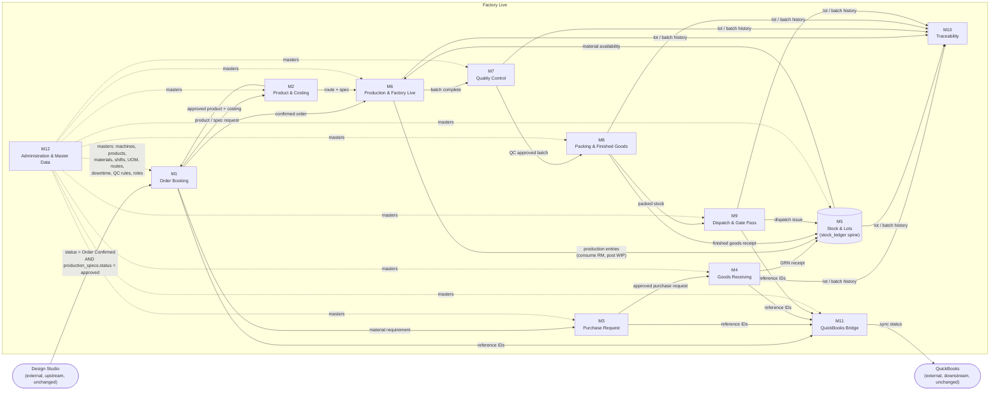

# Digital Modules (Deliverable D)

**Status:** Revision 2 — for review and sign-off
**Reads with:** [`00-README.md`](00-README.md) for the status legend · [`02-form-inventory.md`](02-form-inventory.md) for full form detail · [`05-database-schema.md`](05-database-schema.md) for the tables each module owns · [`08-screen-list.md`](08-screen-list.md) for the complete route list · [`06-user-roles.md`](06-user-roles.md) for the full permission matrix

---

## 1. Purpose of this document

Twelve digital modules (M1–M12) replace the nine paper/Excel forms (F1–F9) identified in
[`02-form-inventory.md`](02-form-inventory.md). This document fixes, for each module, its purpose,
which form(s) it retires, its key screens, the role that owns it operationally, what it depends on
upstream, what consumes its output downstream, and — just as importantly — what it explicitly does
**not** do. Module boundaries here are binding for [`05-database-schema.md`](05-database-schema.md)
(which tables belong to which module) and for [`08-screen-list.md`](08-screen-list.md) (which routes
belong to which module).

Module names and numbers are canonical and used identically across every file in this pack.

---

## 2. Module-to-module data flow

Two structural notes:

- **M5 Stock & Lots is the spine.** It is the only module drawn as a data store rather than a process
  box — M4, M6, M8 and M9 all *post to* it, and M6 also *reads from* it (material availability). This
  matches the append-only ledger design in [`05-database-schema.md §d`](05-database-schema.md#d-stock-model).
- **M12 feeds every other module** as configuration, never as a transactional dependency — a module can
  run against seeded masters on day one and have those masters refined later without a schema change.

---

## 3. Form → Module retirement map

Every one of the nine forms identified in the source evidence maps to exactly one owning module. This
table is the authority for that mapping; [`15-form-retirement-matrix.md`](15-form-retirement-matrix.md)
carries the full 17-column retirement control for each row.

| Form | Title | Document # | Replacing module | Basis |
|---|---|---|---|---|
| F1 | Elastic Costing / Construction Sheet | none (uncontrolled Excel) | **M2** Product & Costing | Composition, price and derived-cost fields become `products` + `product_costings` |
| F2 | Goods Receiving Entry Sheet | none (uncontrolled Excel) | **M4** Goods Receiving | Header/line vehicle-arrival model becomes `grns` + `grn_lines` |
| F3 | Monthly Goods Receiving Summary | none (uncontrolled Excel) | **M5** Stock & Lots | Verified as a derived roll-up of F2 (§5 evidence); becomes a **query**, not an owned table, sourced by M4's postings to `stock_ledger` |
| F4 | Daily Stock Report | none (uncontrolled Excel) | **M5** Stock & Lots | `OPENING + PRODUCTION − DISPATCH = BALANCE` verified exactly; becomes a **query** over `stock_ledger` |
| F5 | Daily Production Report | **IC-FM-01** (controlled) | **M6** Production & Factory Live | Every column preserved in `production_entries`; see [`03-field-extraction.md`](03-field-extraction.md) |
| F6 | Gate Pass | **IC-FM-02** (controlled) | **M9** Dispatch & Gate Pass | Header/line model becomes `gate_passes` + `gate_pass_lines` |
| F7 | Purchase Request | **IC-FM-04** (controlled) | **M3** Purchase Request | Four-level signature block preserved in full as `purchase_request_approvals` |
| F8 | Stock Register | **IC-FM-05** (controlled) | **M5** Stock & Lots | Per-product card ledger; same Opening/Production/Dispatch/Balance columns as F4 — becomes a **query** filtered to one `product_id` |
| F9 | Elastic Order Booking / Processing Form | none (uncontrolled Word) | **M1** Order Booking | Customer, order and product-specification blocks become `orders` + `order_items`, with the QC sampling rule feeding `qc_plan_rules` (§19) |

No form is unassigned. Note that F3, F4 and F8 all resolve to the **same** module (M5) because all
three are, on the evidence, different views of one append-only ledger rather than three separate
transaction sources — see [`05-database-schema.md §d`](05-database-schema.md#d-stock-model) for the
reconciliation proof.

**IC-FM-03** does not appear in the scanned pack at all (`NEEDS CONFIRMATION`, see
[`11-needs-confirmation.md`](11-needs-confirmation.md)) and therefore cannot be mapped to a module here.
No module is proposed against it — inventing a form's contents to justify a module would be a guess.

---

## 4. Module reference

Each module below states: **Purpose**, **Replaces**, **Key screens**, **Owning role**, **Upstream
dependency**, **Downstream consumer**, and **Out of scope**. Owning role is the role that operates the
module day-to-day; other roles retain the access set out in
[`06-user-roles.md`](06-user-roles.md). Routes are illustrative of the final structure under `/factory/*`
and are fixed authoritatively in [`08-screen-list.md`](08-screen-list.md).

### M1 — Order Booking

| | |
|---|---|
| **Purpose** | Capture a confirmed customer order and its product specification, and hold the configurable QC sampling rule that governs it, once the Design Studio has completed technical sign-off. |
| **Replaces** | F9 — Elastic Order Booking / Processing Form (both pages) |
| **Key screens** | `/factory/orders` (list) · `/factory/orders/new` · `/factory/orders/:id` (detail, incl. delivery/cutting/packaging requirements and the Authorization/QC-sampling clause) |
| **Owning role** | Admin (order intake and customer record ownership); Production Manager co-owns feasibility sign-off |
| **Upstream dependency** | Design Studio — the handoff condition in [`05-database-schema.md §i`](05-database-schema.md#i-design-studio-handoff) must be met before an order can reference a confirmed design |
| **Downstream consumer** | M2 (product must exist/be costed before the order line can be priced) · M6 (order drives production order creation) · M3 (material requirement) · M11 (QuickBooks estimate reference) |
| **Out of scope** | Product creation and costing (M2) · production scheduling (M6) · payment/invoicing (M11 references only, no QuickBooks writes) · customer credit checking (not evidenced on any form) |

### M2 — Product & Costing

| | |
|---|---|
| **Purpose** | Own the product master (the canonical article definition) and the costing worksheet that derives per-metre cost from rubber, yarn and overhead inputs. |
| **Replaces** | F1 — Elastic Costing / Construction Sheet |
| **Key screens** | `/factory/masters/products` (list) · `/factory/masters/products/:id` · `/factory/costing` (composition %, price block, derived cost — mirrors F1's three-column Per Lbs / Per Kg / Per Mtr layout) |
| **Owning role** | Production Manager (product definition); Accounts co-owns costing approval |
| **Upstream dependency** | M12 (machine group compatibility, UOM); Design Studio `production_specs` for technical parameters where a product originates from a Studio design |
| **Downstream consumer** | M1 (order line pricing) · M6 (route and `g_per_meter` feed production planning) · M5 (UOM conversions for stock queries) |
| **Out of scope** | Raw material master (M12) · actual purchase pricing negotiation (M3) · QuickBooks price sync (no API calls this phase, M11) |

### M3 — Purchase Request

| | |
|---|---|
| **Purpose** | Digitise the four-level purchase approval chain for raw materials and consumables. |
| **Replaces** | F7 — Purchase Request (IC-FM-04) |
| **Key screens** | `/factory/purchase-requests` (list, filterable by approval level) · `/factory/purchase-requests/new` · `/factory/purchase-requests/:id` (four signature blocks: Prepared / Checked / Preapproved / Approved) |
| **Owning role** | Purchase (preparation); approval progresses through Supervisor/Production Manager (Checked), Production Manager/Accounts (Preapproved) and Admin (Approved) — exact role-to-level assignment is a factory decision, configurable via `factory_user_roles`, not hardcoded |
| **Upstream dependency** | M2/M12 (material master for line-item selection) · M6 (material shortfall trigger from a production order in `MATERIALS_PENDING`) |
| **Downstream consumer** | M4 (an approved purchase request is the reference a GRN is received against) · M11 (QuickBooks PO reference) |
| **Out of scope** | Supplier negotiation/quotation comparison (not evidenced on F7) · goods receipt itself (M4) · payment (M11 reference only) |

### M4 — Goods Receiving

| | |
|---|---|
| **Purpose** | Record vehicle arrivals and the material lines they carry, and post the receipt to the stock ledger. |
| **Replaces** | F2 — Goods Receiving Entry Sheet |
| **Key screens** | `/factory/grn` (list, one row per vehicle arrival) · `/factory/grn/new` · `/factory/grn/:id` (header + line table, preserving the one-arrival-many-articles structure) |
| **Owning role** | Store |
| **Upstream dependency** | M3 (purchase request reference, where one exists) · M12 (supplier and material masters) |
| **Downstream consumer** | M5 (every GRN line posts a `stock_ledger` row and, where lot control applies, a `material_lots` row) · M10 (traceability start point) · M11 (QuickBooks bill/PO reference) |
| **Out of scope** | Supplier invoice matching/payment (M11 reference only) · the monthly summary report itself (a query owned by M5, not a screen owned by M4) |

### M5 — Stock & Lots

| | |
|---|---|
| **Purpose** | Hold the single append-only `stock_ledger` — the spine every other stock view (daily report, per-product register, monthly summary) is a query over — and the `material_lots` table for lot/batch traceability. |
| **Replaces** | F3 — Monthly Goods Receiving Summary · F4 — Daily Stock Report · F8 — Stock Register (IC-FM-05) |
| **Key screens** | `/factory/stock` (daily balance view, replaces F4) · `/factory/stock/register/:productId` (per-product running card, replaces F8) · `/factory/stock/receiving-summary` (monthly roll-up, replaces F3) · `/factory/stock/lots` |
| **Owning role** | Store (day-to-day); Viewer role reads all three report views without write access |
| **Upstream dependency** | M4 (receipts) · M6 (production consumption/output) · M8 (finished-goods receipt) · M9 (dispatch issue) |
| **Downstream consumer** | M6 (material availability check) · M10 (full movement history per lot) · M9 (available-to-dispatch quantity) |
| **Out of scope** | Any UI for editing a historical balance directly — corrections are new ledger rows, never updates, per [`05-database-schema.md §d`](05-database-schema.md#d-stock-model) |

### M6 — Production & Factory Live

| | |
|---|---|
| **Purpose** | Capture the daily production entry (every IC-FM-01 column, preserved) and present the live, multi-level Factory Live drill-down described in [`09-factory-live-drilldown.md`](09-factory-live-drilldown.md). |
| **Replaces** | F5 — Daily Production Report (IC-FM-01) |
| **Key screens** | `/factory/production/entry` (entry list) · `/factory/production/entry/new` · `/factory` (five-level drill-down: `/factory/process/:slug` → `/factory/group/:groupId` → `/factory/machine/:machineId` → `/factory/order/:orderId` → `/factory/batch/:batchId`) · `/factory/production/downtime` |
| **Owning role** | Operator (entry); Supervisor (oversight and downtime closure); Production Manager (live dashboard, machine assignment) |
| **Upstream dependency** | M1 (confirmed order) · M2 (route and product spec) · M5 (material availability) · M12 (machine, shift, operator, downtime-reason masters) |
| **Downstream consumer** | M5 (every production entry posts a WIP movement) · M7 (batch completion triggers inspection) · M10 (production history per batch) · M14/KPI dictionary (every live card field) |
| **Out of scope** | Any KPI not defined in [`14-kpi-dictionary.md`](14-kpi-dictionary.md) — a Factory Live card field with no KPI definition is not displayed · IoT/PLC data ingestion (§m, `FUTURE`) · payroll calculation from `pr_strip_amount` (flagged `NEEDS CONFIRMATION`, not built) |

### M7 — Quality Control

| | |
|---|---|
| **Purpose** | Apply the configurable QC sampling rule (from F9's Authorization clause) and record inspection results and defects against a completed production batch. |
| **Replaces** | No paper form directly — the QC sampling rule is embedded as prose inside F9's Authorization block; formal inspection recording does not exist on paper today. Tag: `NEW per §19`. |
| **Key screens** | `/factory/qc` (pending inspections) · `/factory/qc/:batchId` · `/factory/masters/qc-rules` (configurable `qc_plan_rules`) |
| **Owning role** | Quality |
| **Upstream dependency** | M6 (batch marked complete → `QC_PENDING`) |
| **Downstream consumer** | M8 (only a `QC_APPROVED` batch may be packed) · M10 (inspection result attaches to lot/batch history) |
| **Out of scope** | Statistical process control / SPC charting (not evidenced, not requested) · automatic disposition of `QC_HOLD` (always a human decision, see the status transition table) |

### M8 — Packing & Finished Goods

| | |
|---|---|
| **Purpose** | Record packing of a QC-approved batch into finished-goods stock, consuming packaging materials (e.g. cartons) from the raw material master. |
| **Replaces** | No paper form directly observed — packing is implied by F2's "Empty Carton" receiving lines and F4/F8's `FINISHED GOODS` category but has no dedicated source document. Tag: `NEW per §7`/`§9`. |
| **Key screens** | `/factory/packing` · `/factory/packing/:batchId` · `/factory/finished-goods` |
| **Owning role** | Store |
| **Upstream dependency** | M7 (QC-approved batch) · M12 (packaging material master, e.g. `Empty Carton`) |
| **Downstream consumer** | M5 (finished-goods receipt posted to `stock_ledger`) · M9 (available finished goods for dispatch) |
| **Out of scope** | Product labelling/artwork generation (owned by the Design Studio, not duplicated here) |

### M9 — Dispatch & Gate Pass

| | |
|---|---|
| **Purpose** | Record outbound (and returnable inbound) movements of goods through the factory gate, and the dispatch transaction against a customer order. |
| **Replaces** | F6 — Gate Pass (IC-FM-02) |
| **Key screens** | `/factory/dispatch` · `/factory/dispatch/new` · `/factory/gate-pass` · `/factory/gate-pass/new` (Returnable / Non-Returnable, matching F6's checkboxes) |
| **Owning role** | Store |
| **Upstream dependency** | M8 (available finished goods) · M1 (order being fulfilled) |
| **Downstream consumer** | M5 (dispatch issue posted to `stock_ledger`) · M10 (dispatch closes the traceability chain) · M11 (QuickBooks invoice reference) |
| **Out of scope** | Freight/logistics booking · invoicing (M11 reference only) |

### M10 — Traceability

| | |
|---|---|
| **Purpose** | Reconstruct the full forward and backward movement history of a lot, batch or order — which raw material lot went into which production batch, which batch was packed into which finished-goods lot, and which dispatch it left on. |
| **Replaces** | No paper form — traceability by lot is not possible today because F2 captures no lot/PO/GRN number (evidence §7). Tag: `NEW per §7`. |
| **Key screens** | `/factory/traceability` (search by lot, batch, order or GRN) · `/factory/traceability` (chain view) |
| **Owning role** | Quality (audit and customer-complaint investigation); read access for Admin and Viewer |
| **Upstream dependency** | M4, M5, M6, M7, M8, M9 — all provide the linked records this module queries |
| **Downstream consumer** | None internal — this is a reporting/audit endpoint consumed by management and, where required, by ISO 17021-aligned audit evidence requests |
| **Out of scope** | Data entry of any kind — M10 is read-only over records owned by other modules · traceability **cannot** be back-dated for GRNs received before lot capture went live (evidence §7, explicit limitation) |

### M11 — QuickBooks Bridge

| | |
|---|---|
| **Purpose** | Store QuickBooks reference identifiers and sync-status fields against the Factory Live records they correspond to, so that a future integration phase has somewhere to write. |
| **Replaces** | No paper form — QuickBooks itself is the existing system of record for accounting; this module only adds reference columns on the Factory Live side. |
| **Key screens** | `/factory/admin/quickbooks` (sync status dashboard — read-only in this phase) |
| **Owning role** | Accounts |
| **Upstream dependency** | M1, M3, M4, M9 (the records that carry `quickbooks_*_id` reference columns, per [`05-database-schema.md §k`](05-database-schema.md#k-quickbooks-reference-columns)) |
| **Downstream consumer** | QuickBooks (external, unchanged) |
| **Out of scope** | **No QuickBooks API calls are designed or built in this phase.** All fields are reference/placeholder columns populated manually or by a future sync job. See [`07-quickbooks-mapping.md`](07-quickbooks-mapping.md). |

### M12 — Administration & Master Data

| | |
|---|---|
| **Purpose** | Own every configurable master (machines, machine groups, products' shared reference data, materials, suppliers, customers, operators, shifts, locations, UOMs, downtime reasons, process routes, QC plan rules, factory roles) so the factory can maintain its own reference data without a developer. |
| **Replaces** | No single form — this module formalises reference data that today is re-typed as free text on every other form (e.g. `Supplier`, `Article`, `MACH NO` are all free text on F2/F5 with no backing master). |
| **Key screens** | `/factory/masters/machines` · `/factory/masters/machine-groups` · `/factory/masters/materials` · `/factory/masters/suppliers` · `/factory/masters/customers` · `/factory/masters/operators` · `/factory/masters/shifts` · `/factory/masters/locations` · `/factory/masters/uoms` · `/factory/masters/downtime-reasons` · `/factory/masters/routes` · `/factory/masters/roles` |
| **Owning role** | Admin |
| **Upstream dependency** | None — this is the root configuration layer |
| **Downstream consumer** | Every other module (M1–M11) reads these masters; see the dotted lines in the flow diagram above |
| **Out of scope** | Any transactional data (orders, production entries, dispatches, etc.) — those belong to the modules that own them |

---

## 5. Cross-references

- Table ownership by module → [`05-database-schema.md`](05-database-schema.md)
- Full route list and screen wireframe notes → [`08-screen-list.md`](08-screen-list.md)
- Role-to-module permission detail → [`06-user-roles.md`](06-user-roles.md)
- Every field on every form, verbatim → [`03-field-extraction.md`](03-field-extraction.md)
- Migration sequencing per module → [`10-migration-plan.md`](10-migration-plan.md)
