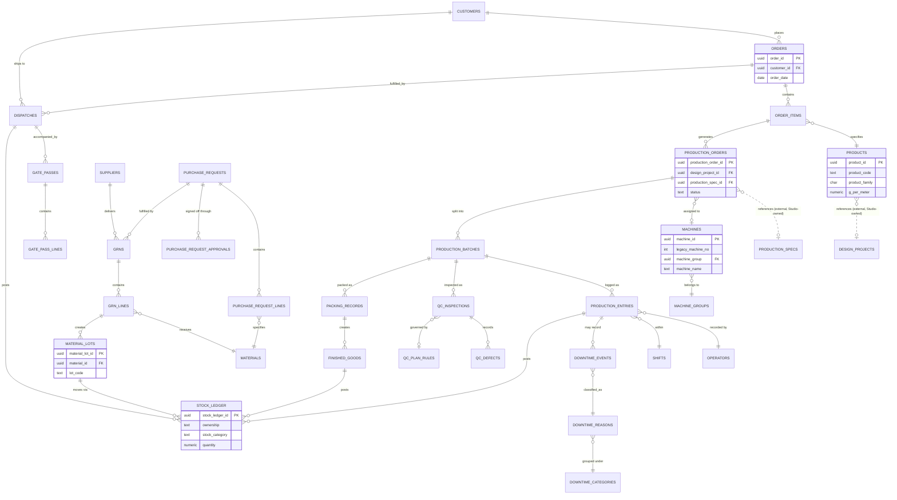
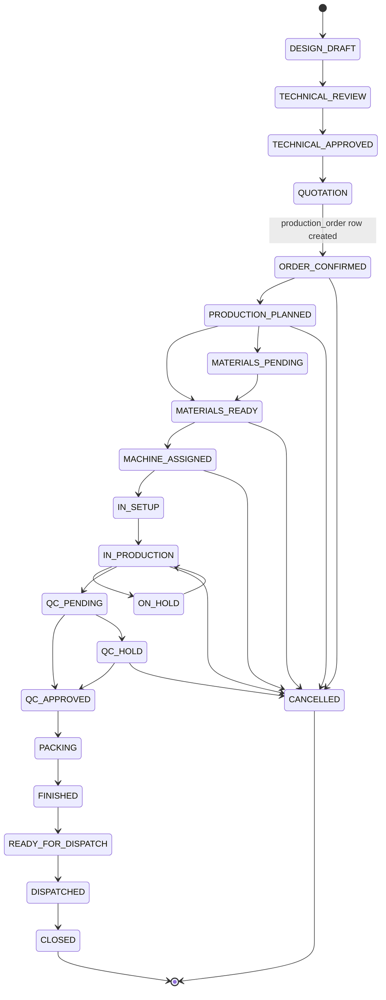

# Database Schema (Deliverable E)

**Status:** Revision 2 — for review and sign-off. **This is a design document. No SQL migration
files exist or are created by this pack** — illustrative pseudo-DDL below is markdown, not executable.
**Reads with:** [`00-README.md`](00-README.md) for the status legend · [`04-digital-modules.md`](04-digital-modules.md)
for which module owns which table · [`03-field-extraction.md`](03-field-extraction.md) for the verbatim
source of every preserved field · [`11-needs-confirmation.md`](11-needs-confirmation.md) for the
consolidated open-questions register · [`13-master-data-migration.md`](13-master-data-migration.md) for
how each master gets populated.

---

## Tag legend

| Tag | Meaning |
|---|---|
| `CONFIRMED` | Read directly off a scanned form, or verified by arithmetic that reconciles exactly |
| `INFERRED FROM ARITHMETIC — NEEDS CONFIRMATION` | Reconciles mathematically; business meaning not yet confirmed |
| `DERIVED` | Computed by the system from another column; never keyed by a user |
| `NEEDS CONFIRMATION` | Unknown, not guessed — must be answered before build |
| `BLOCKING` | A `NEEDS CONFIRMATION` item whose answer would change this schema |
| `NEW per §<n>` | Has no paper equivalent; added because the section referenced below asked for it |
| `STANDARD` | One of the four uniform audit columns applied to every table per design principle §a |
| `FUTURE` | Design accommodates it; not built in V1 |

### Section-reference key

Because `NEW per §<n>` tags recur across every file in this pack, the pack uses one shared numbering
key so a tag means the same thing everywhere. It is reproduced here for this file's self-containment.

| § | Subject | § | Subject |
|---|---|---|---|
| §2 | Machine master | §19 | QC plan rule (F9 sampling clause) |
| §3 | Machine groups master | §20 | Purchase Request four-level approval |
| §4 | Product master | §21 | Legacy form-reference table |
| §5 | Raw material master | §22 | Form retirement matrix |
| §6 | Stock ledger — core model | §24 | QuickBooks ownership split |
| §7 | Stock ledger — GRN traceability gaps | §25 | QuickBooks reference/sync columns |
| §8 | UOM model | §26 | 15-column field mapping matrix |
| §9 | Process routing master | §27 | Audit trail (18 events) |
| §10 | Production order status model | §28 | Factory Live status colour tokens |
| §11 | Design Studio handoff | §29 | Migration phases |
| §12 | Administration / RLS / factory roles | §30 | First vertical slice |
| §13 | Factory Live drill-down / KPI gate | §32 | Blocking open questions |
| §14 | KPI dictionary | §33 | Final report structure |
| §16 | Production entry new digital fields | §34 | Brief conformance check |
| §17 | Downtime category/reason (two levels) | §a–§m | Sections of this document |
| §18 | Shift master | | |

---

## a. Design principles

1. **Single-tenant, role-based RLS — no `org_id`.** Interconverters is one factory. Every table's
   access control is a function of *which of the ten roles the authenticated user holds*
   (`factory_user_roles`), mirroring the existing `is_staff(uid)` pattern in
   `supabase/migrations/0001_init.sql` rather than introducing tenant partitioning nothing in the
   brief calls for.
2. **The stock ledger is append-only and is the spine.** `stock_ledger` rows are inserted, never
   updated or deleted. Every stock view in the pack — the daily report (F4), the per-product register
   (F8), the monthly receiving summary (F3) — is a **query** over this one table, not a separately
   maintained record. See §d.
3. **Masters are configurable by the factory without a developer.** Machine groups, shifts, downtime
   reasons, process routes, UOM conversions and QC plan rules are all rows in tables, edited through
   Administration screens (M12) — none of these lists is hardcoded in application code or migration
   seed data beyond an initial, explicitly-labelled seed.
4. **Design Studio data is referenced, never copied.** `production_orders` carries
   `design_project_id`, `design_revision_id` and `production_spec_id` as plain foreign keys into the
   Studio's existing tables. No Studio column is duplicated into a Factory Live table. See §i.
5. **QuickBooks references only.** Every `quickbooks_*_id` column stores an external identifier and
   nothing else. QuickBooks remains the financial system of record; Factory Live does not maintain a
   parallel ledger of amounts owed or paid. See §k.
6. **Every table gets `created_at` / `created_by` / `updated_at` / `updated_by`.** These four columns
   are applied uniformly and are tagged `STANDARD` in every column table below rather than repeated
   as `NEW per §<n>` — the paper forms' closest equivalent is a signature line (`Prepared By`,
   `Checked By`, `Reviewed By`), which is preserved *separately* as a named business field wherever a
   form actually carries one (e.g. `production_entries.prepared_by`), not conflated with these system
   audit columns.
   **Exception:** `stock_ledger` (§d) is append-only by design — rows are never updated, so it carries
   `created_at` / `created_by` only. A correction is a new, reversing ledger row, never an `UPDATE`.

---

## b. Entity-relationship overview



`DESIGN_PROJECTS` and `PRODUCTION_SPECS` above are drawn only to show the reference boundary — they
are Studio-owned tables from `0001_init.sql` / `0002_production_specs.sql` and are not redefined in
this document. Every table drawn solid is defined in §c and §g below.

---

## c. Master data tables

Twenty master tables. Every table below also carries the four `STANDARD` audit columns from §a
(omitted from the row list where obvious, shown explicitly on the first table as a worked example).

### `machine_groups`

Configurable master. **Nothing about machine groups is hardcoded around Warp Knitting** — the seed
list below is a starting point the factory can add to, rename or deactivate through M12 without a
developer.

| Column | Type | Null | Description | Tag |
|---|---|---|---|---|
| `machine_group_id` | uuid | not null (PK) | Canonical identifier | `NEW per §3` |
| `group_code` | text | not null, unique | Short code, e.g. `WARP-KNIT` | `NEW per §3` |
| `group_name` | text | not null | Display name | `NEW per §3` |
| `description` | text | null | Free text | `NEW per §3` |
| `display_order` | int | null | Sort order in UI | `NEW per §3` |
| `active_status` | boolean | not null, default `true` | Whether selectable for new machines | `NEW per §3` |
| `created_at` | timestamptz | not null | | `STANDARD` |
| `created_by` | text | not null | | `STANDARD` |
| `updated_at` | timestamptz | not null | | `STANDARD` |
| `updated_by` | text | null | | `STANDARD` |

**Seed rows** (initial, editable):

| group_code | group_name |
|---|---|
| `WARP-KNIT` | Warp Knitting |
| `JACQUARD` | Jacquard |
| `NEEDLE-LOOM` | Needle Loom |
| `CROCHET` | Crochet |
| `WARPING` | Warping |
| `CONE-WIND` | Cone Winding |
| `PRESS-FIN` | Press / Finishing |
| `PACKING` | Packing |
| `OTHER` | Other |

### `machines` — the critical master

**This is the correction the pack turns on.** Legacy `MACH NO` values 1–17, recorded verbatim on every
row of IC-FM-01 (F5), are **not established** to be the same physical population as "the six 24-needle
warp-knitting machines" referred to elsewhere in the brief. The table therefore carries both an ID for
each population as **separate columns**, and nothing in the schema merges them.

> **Update — both machine-population questions are now RESOLVED.** [NC-02](11-needs-confirmation.md):
> Interconverters confirms `MACH NO` directly identifies a physical machine, one-to-one, not a process
> station or line position. [NC-03](11-needs-confirmation.md): the factory operates **17 machines in
> total** under the legacy `MACH NO` system, and the six 24-needle warp-knitting machines are a
> **confirmed subset of those 17** — not the same population (17 ≠ 6) and not a separate one.
> `legacy_machine_no` (1–17) is therefore the complete, confirmed machine population for this table.
> **One item remains, and it is non-blocking (NC-28):** which specific 6 of the 17 are the
> warp-knitting units, and what machine group the other 11 belong to, is master-data population, not a
> schema question — the table below already has one row per machine with a `machine_group` FK ready to
> hold the answer.

| Column | Type | Null | Description | Tag |
|---|---|---|---|---|
| `machine_id` | uuid | not null (PK) | New canonical identifier, assigned by Factory Live | `NEW per §2` |
| `legacy_machine_no` | int | null | The `MACH NO` value exactly as it appears on IC-FM-01 (1–17 observed) | `CONFIRMED` (F5) |
| `machine_group` | uuid (FK `machine_groups`) | not null | Which configurable group this machine belongs to | `NEW per §2` |
| `machine_type` | text | null | Free-text sub-type within the group (e.g. specific knitting head type) | `NEW per §2` |
| `machine_name` | text | not null | Display name, e.g. `MCH 13` as printed on F1 | `CONFIRMED` (F1 top-left `MCH 13`) |
| `needle_taar_configuration` | text | null | Needle/taar configuration string — see F5's `Taar` column for the values observed per job | `INFERRED FROM ARITHMETIC — NEEDS CONFIRMATION` whether this is a fixed machine attribute or a per-job article attribute |
| `machine_model` | text | null | Manufacturer's model designation | `NEW per §2` |
| `manufacturer` | text | null | | `NEW per §2` |
| `serial_number` | text | null | | `NEW per §2` |
| `quantity_reference` | int | null | Where one logical "machine" record represents a bank of identical physical units | `NEW per §2` |
| `physical_location` | uuid (FK `locations`) | null | | `NEW per §2` |
| `production_section` | text | null | Free-text shop-floor section label | `NEW per §2` |
| `process_step` | uuid (FK `process_steps`) | null | Default process step this machine performs | `NEW per §2` (see §f) |
| `active_status` | boolean | not null, default `true` | | `NEW per §2` |
| `installation_date` | date | null | | `NEW per §2` |
| `capacity` | numeric | null | Nominal capacity (units per §e, product-dependent) | `NEW per §2` |
| `standard_speed` | numeric | null | Compare with F5's per-job `machine speed` (400 observed) — this is the machine's *rated* speed, not a job reading | `NEW per §2` |
| `working_width_mm` | numeric | null | The machine's total working width — what `product.width_mm` divides into to determine how many parallel strips a job can run. Added on NC-07 resolution: `STRIP` is set by how many times the article's width fits across the machine's width, not a fixed attribute of either the machine or the product alone. | `NEW per §2` — added on NC-07 resolution |
| `compatible_product_families` | text[] | null | Subset of `J`/`W`/`K` | `NEW per §2` |
| `notes` | text | null | | `NEW per §2` |
| `created_at` / `created_by` / `updated_at` / `updated_by` | — | — | | `STANDARD` |

**Illustrative example rows — `machine_id` and `machine_group` values are placeholders; the population
size (17) and the warp-knitting subset are confirmed, the specific mapping is not:**

| machine_id (illustrative) | legacy_machine_no | machine_group | machine_name |
|---|---|---|---|
| `WKM-24-01` … `WKM-24-06` (illustrative) | *6 of 1–17, which ones is `NEEDS CONFIRMATION`* | Warp Knitting | *TBD* |
| *TBD* | *the other 11 of 1–17* | *TBD — Crochet? Needle Loom? Other?* | *TBD* |

> **NC-03 — RESOLVED (population shape).** Interconverters confirms 17 machines total under `MACH NO`,
> with the six 24-needle warp-knitting machines as a confirmed subset of those 17. `WKM-24-01`…`06`
> remain illustrative IDs only — they still do not map to any specific `legacy_machine_no`.
>
> **NC-28 — NON-BLOCKING, open.** Which 6 of the 17 `legacy_machine_no` values are the warp-knitting
> units, and what machine group the other 11 belong to, is master-data population, not a schema
> question. Worth weighing when this is answered: F5's sample data shows machines running `6 Taar`,
> `7 Taar`, `13 Taar`, `8 Tar` and `26 Tar 5 CM` articles across the 17 machines — more variety than six
> identical warp-knitting units alone would produce — and F9's order form separately selects `Crochet`
> as the elastic construction type, a distinct machine group from Warp Knitting in the brief's own §13
> list. A split of 6 Warp Knitting plus a mix of Crochet/Needle Loom/other across the remaining 11 is
> plausible, not a conclusion. **Do not assign this specific mapping anywhere in this pack.** See
> [`11-needs-confirmation.md`](11-needs-confirmation.md).

### `products` — product master

Preserves the family codes `J` = Jacquard, `K` = Knitted, `W` = Woven — **these match the Design
Studio's `Family` type exactly** (`src/lib/types.ts`, line: `export type Family = 'J' | 'W' | 'K';`,
marked FROZEN). No new family code is introduced.

| Column | Type | Null | Description | Tag |
|---|---|---|---|---|
| `product_id` | uuid | not null (PK) | | `NEW per §4` |
| `product_code` | text | not null, unique | | `NEW per §4` |
| `product_family` | char(1) | not null | `J` \| `K` \| `W` — matches Studio `Family` | `CONFIRMED` (concept; Studio alignment) |
| `description` | text | not null | e.g. `13 Tar`, `6 Taar Double` | `CONFIRMED` (F4, F5 Column2, F9) |
| `customer_reference` | text | null | Customer's own article code, where supplied | `NEW per §4` |
| `width_mm` | numeric | not null | Canonical width | `CONFIRMED` (F9 `Width`, converted) |
| `width_inch` | numeric | null | **DERIVED**, never keyed — `width_mm ÷ 25.4` | `DERIVED` |
| `elastic_non_elastic` | text | null | `Elastic` \| `Non-Elastic` | `CONFIRMED` (F9) |
| `construction` | text | null | e.g. `Crochet`, `Jacquard`, `Needle` | `CONFIRMED` (F9 circle-one list) |
| `rubber_core_configuration` | text | null | | `NEW per §4` |
| `rubber_specification` | text | null | Rubber count, e.g. `52` | `CONFIRMED` (F9 `Rubber:`) |
| `yarn_type` | text | null | | `CONFIRMED` (F9 `Poly Thread Weft/Warp`) |
| `yarn_count` | text | null | e.g. `150 Danier`, `300 Danier` | `CONFIRMED` (F9) |
| `poly_thread` | text | null | | `CONFIRMED` (F9) |
| `color` | text | null | | `CONFIRMED` (F9 — note the paper form itself has both `Colour:` and `Color:` fields, both filled `White` in the sample; treated as one field here) |
| `finish` | text | null | e.g. `Starch` | `CONFIRMED` (F9 circle-one list) |
| `edge_style` | text | null | | `NEW per §4` |
| `g_per_meter` | numeric | not null | **CANONICAL.** Weight per metre, grams. All other weight/length derivations key off this one field. | `CONFIRMED` (F1 `Elastic wt Gr`, F5 `G.WT/MTR`, F9 `Wt of 1000 Mtr` ÷ 1000) |
| `meters_per_kg` | numeric | null | **DERIVED**, never keyed — `1000 ÷ g_per_meter` | `DERIVED` |
| `standard_roll_length` | numeric | null | | `NEW per §4` |
| `target_elongation` | numeric | null | | `NEW per §4` |
| `tolerance` | text | null | | `NEW per §4` |
| `machine_group_compatibility` | uuid[] (FK `machine_groups`) | null | | `NEW per §4` |
| `machine_compatibility` | uuid[] (FK `machines`) | null | | `NEW per §4` |
| `standard_cost_per_meter` | numeric | null | Latest approved `product_costings` figure | `CONFIRMED` (concept, F1 `Total per Mtr Cost`) |
| `active_status` | boolean | not null, default `true` | | `NEW per §4` |
| `legacy_reference` | text | null | Free-text pointer back to the source form/row | `NEW per §4` |
| `notes` | text | null | | `NEW per §4` |
| `created_at` / `created_by` / `updated_at` / `updated_by` | — | — | | `STANDARD` |

**Canonical/derived evidence proof** (do not re-key `meters_per_kg` or `width_inch` — compute them):

```
g_per_meter is CANONICAL:
    F9: "Wt of 1000 Mtr 8.76 Kg"  ->  8.76 kg / 1000 m = 8.76 g/m
    F1: "Elastic wt Gr 5.97" (composition) / "5.96" (totals) — same fact, different sheet

meters_per_kg is DERIVED = 1000 / g_per_meter, never keyed:
    F9: 1000 / 8.76  = 114.15  -> printed "Mtrs in 1 kg 114 Meters"   MATCHES
    F1: 1000 / 5.96  = 167.79  -> printed "Meter In Per Kg 168"       MATCHES (rounding)

width_inch is DERIVED = width_mm / 25.4, never keyed:
    F9 supplies the inverse direction as evidence that the fact is unit-portable:
    "Width: 1 inch" — the paper form itself only records the inch value; the digital model's
    width_mm becomes the canonical entry field and width_inch is derived back from it.
```

### `materials` — raw material master

| Column | Type | Null | Description | Tag |
|---|---|---|---|---|
| `material_id` | uuid | not null (PK) | | `NEW per §5` |
| `material_code` | text | not null, unique | | `NEW per §5` |
| `description` | text | not null | | `CONFIRMED` (F2 `Article`) |
| `material_category` | text | not null | See fixed category list below | `NEW per §5` |
| `specification` | text | null | e.g. rubber count `32`, thread denier | `CONFIRMED` (F2/F3/F5 cross-reference) |
| `supplier` | uuid (FK `suppliers`) | null | Default/preferred supplier | `CONFIRMED` (F2 `Supplier`) |
| `supplier_item_code` | text | null | | `NEW per §5` |
| `primary_uom` | uuid (FK `uoms`) | not null | | `CONFIRMED` (F2 `Total Weight` implies Kg) |
| `secondary_uom` | uuid (FK `uoms`), null | null | e.g. Cone | `CONFIRMED` (F2 `Per Cone Wt`) |
| `conversion_factor` | numeric | null | Secondary→primary UOM factor | `NEW per §5` (see §e for the reconciliation evidence) |
| `weight_per_unit` | numeric | null | | `NEW per §5` |
| `standard_cost` | numeric | null | | `NEW per §5` |
| `quickbooks_item_id` | text | null | | `NEW per §25` |
| `lot_control_required` | boolean | not null, default `false` | | `NEW per §5` |
| `expiry_control_required` | boolean | not null, default `false` | | `NEW per §5` |
| `stock_location` | uuid (FK `locations`) | null | | `NEW per §5` |
| `minimum_stock` | numeric | null | | `NEW per §5` |
| `reorder_level` | numeric | null | | `NEW per §5` |
| `active_status` | boolean | not null, default `true` | | `NEW per §5` |
| `notes` | text | null | | `NEW per §5` |
| `created_at` / `created_by` / `updated_at` / `updated_by` | — | — | | `STANDARD` |

**Material categories** (fixed enum, configurable list of *values within* the category column via
M12): `Rubber` · `Yarn` · `Polyester Thread` · `Other Thread` · `Packaging` · `Consumables` ·
`Accessories` · `Other`.

**Worked examples — real F2/F3 articles mapped to categories:**

| Article as received (F2) | `material_category` | Evidence / notes |
|---|---|---|
| `Rubber Fintex(32)` | Rubber | F2 Supplier: Z&Z Packages. Specification `32` matches F3 `Count` and F5 `RUBBER` |
| `Rubber (38) Thailand W/F` | Rubber | F2 Supplier: Z&Z Packages; F3 records supplier as "World Flex Thialand" [sic] |
| `Thread Polyester (China)` | Polyester Thread | F2 Supplier: Z&Z Packages; F3: "150 Polyester" |
| `300/96-YDPS-071NA-PO` | Polyester Thread | F2 Supplier: Gatron; F3: "300 Danier" |
| `Empty Carton` | Packaging | F2 Supplier: Z&Z Packages (both receiving rows) |
| `Machine Garari` | Accessories | F2 Supplier: Z&Z Packages, "Rcvd From Z&Z" — item definition `NEEDS CONFIRMATION` |
| `Elastic Machine (Single)` | *excluded* | Received "for Production" — this is capital equipment, not a raw material; it belongs on `machines`/an asset register, not `materials`. Flagged here only to record that it is deliberately **not** modelled as a material. |
| `Weight Pcs For Thread` | Other | F2 remarks "Mix" for both `Total Weight` and `Per Cone Wt` — nature of this line `NEEDS CONFIRMATION` |

### `shifts`

Configurable master. **NC-10 — RESOLVED.** Interconverters confirms `Day` and `Night`, as written on
F5's `NAME` column, are the real shifts; `A`, `N` and `Z` are **team/crew codes, not shift codes** — a
separate rotating-group dimension (see `teams` immediately below). This table stays a simple two-row
seed (`Day`, `Night`).

| Column | Type | Null | Description | Tag |
|---|---|---|---|---|
| `shift_id` | uuid | not null (PK) | | `NEW per §18` |
| `shift_code` | text | not null, unique | `DAY` \| `NIGHT` | `CONFIRMED` shape (NC-10) |
| `shift_name` | text | not null | | `CONFIRMED` (F5 `NAME` suffix `Day`/`Night`) |
| `start_time` | time | null | Duration is `CONFIRMED` as 12 hours (F5 `SHIFT TIME`); clock start time is `NEEDS CONFIRMATION` — `NON-BLOCKING` (NC-26) | `NEEDS CONFIRMATION` (value only) |
| `end_time` | time | null | As above | `NEEDS CONFIRMATION` (value only) |
| `cross_midnight` | boolean | not null, default `false` | Night almost certainly does; not yet confirmed | `NEW per §18` |
| `active` | boolean | not null, default `true` | | `NEW per §18` |
| `notes` | text | null | | `NEW per §18` |
| `created_at` / `created_by` / `updated_at` / `updated_by` | — | — | | `STANDARD` |

### `teams` — NEW, added on NC-10 resolution

Configurable master for the `A` / `N` / `Z` codes observed in F4's footer (`Day (A & N)` /
`Night (N & Z)`). Kept structurally separate from `shifts` — a team rotates across shifts, it does not
define one.

| Column | Type | Null | Description | Tag |
|---|---|---|---|---|
| `team_id` | uuid | not null (PK) | | `NEW — NC-10 resolution` |
| `team_code` | text | not null, unique | e.g. `A`, `N`, `Z` as observed on F4 | `CONFIRMED` code shape (F4 footer); meaning of each letter still open |
| `team_name` | text | null | | `NEW` |
| `active` | boolean | not null, default `true` | | `NEW` |
| `notes` | text | null | | `NEW` |
| `created_at` / `created_by` / `updated_at` / `updated_by` | — | — | | `STANDARD` |

### `operators`

| Column | Type | Null | Description | Tag |
|---|---|---|---|---|
| `operator_id` | uuid | not null (PK) | | `NEW per §12` |
| `operator_code` | text | not null, unique | | `NEW per §12` |
| `full_name` | text | not null | F5 records first names only (`Ahmed`, `Awias`, `Bahadue`, `Hamza`) | `CONFIRMED` (partial — first name only) |
| `default_shift_id` | uuid (FK `shifts`) | null | | `NEW per §18` |
| `default_machine_group` | uuid (FK `machine_groups`) | null | | `NEW per §12` |
| `employee_id_external` | text | null | HR/payroll cross-reference — relevant to the `pr_strip_amount` payroll question, `NEEDS CONFIRMATION` | `NEW per §16` |
| `contact_phone` | text | null | | `NEW per §12` |
| `joining_date` | date | null | | `NEW per §12` |
| `active_status` | boolean | not null, default `true` | | `NEW per §12` |
| `notes` | text | null | | `NEW per §12` |
| `created_at` / `created_by` / `updated_at` / `updated_by` | — | — | | `STANDARD` |

### `suppliers`

| Column | Type | Null | Description | Tag |
|---|---|---|---|---|
| `supplier_id` | uuid | not null (PK) | | `NEW per §7` |
| `supplier_code` | text | not null, unique | | `NEW per §7` |
| `supplier_name` | text | not null | | `CONFIRMED` (F2: `Z&Z Packages`, `Gatron`) |
| `supplier_type` | text | null | e.g. Raw Material / Toll Partner / Service — relevant to the ownership question below | `NEW per §24` |
| `address` | text | null | | `NEW per §7` |
| `contact_person` | text | null | | `NEW per §7` |
| `contact_phone` | text | null | | `NEW per §7` |
| `contact_email` | text | null | | `NEW per §7` |
| `quickbooks_vendor_id` | text | null | | `NEW per §25` |
| `payment_terms` | text | null | | `NEW per §7` |
| `active_status` | boolean | not null, default `true` | | `NEW per §7` |
| `notes` | text | null | See flag below | `NEW per §7` |
| `created_at` / `created_by` / `updated_at` / `updated_by` | — | — | | `STANDARD` |

> **Flag on `Z&Z Packages` — NC-13 RESOLVED (shape); NC-27 open (per-transaction default).**
> Interconverters confirms Z&Z holds a **dual role**: Z&Z is a vendor (as recorded on F2/F3) but is
> *also* a customer of Interconverters. Gatron is vendor-only. This means `suppliers` and `customers`
> are **not mutually exclusive** — the same real-world business may hold a row in both tables,
> cross-referenced by shared business name/`legacy_reference` rather than merged into one "party"
> entity (no schema change needed; both tables already exist independently). The dual role is
> consistent with — but does not by itself prove — every Z&Z receipt being toll-manufacturing input;
> see §d for the resulting `ownership` default and NC-27 in
> [`11-needs-confirmation.md`](11-needs-confirmation.md) for the residual, non-blocking question.

### `customers`

| Column | Type | Null | Description | Tag |
|---|---|---|---|---|
| `customer_id` | uuid | not null (PK) | | `NEW per §12` |
| `customer_code` | text | not null, unique | | `NEW per §12` |
| `customer_name` | text | not null | | `CONFIRMED` (F9: `PAKEEZAH DYEING & BLEACHING`) |
| `address` | text | null | | `CONFIRMED` (F9) |
| `contact_person` | text | null | | `CONFIRMED` (F9: `Mustafa (Merchandiser)`) |
| `contact_phone` | text | null | | `CONFIRMED` (F9: `0314-5040874`) |
| `contact_email` | text | null | | `CONFIRMED` (F9: `info@pakeezah.net`) |
| `order_channel_default` | text | null | Email / Phone / Verbal | `CONFIRMED` (F9 `Through-Email-Phone-Verbal` field) |
| `quickbooks_customer_id` | text | null | | `NEW per §25` |
| `credit_terms` | text | null | | `NEW per §12` |
| `active_status` | boolean | not null, default `true` | | `NEW per §12` |
| `notes` | text | null | | `NEW per §12` |
| `created_at` / `created_by` / `updated_at` / `updated_by` | — | — | | `STANDARD` |

### `locations`

| Column | Type | Null | Description | Tag |
|---|---|---|---|---|
| `location_id` | uuid | not null (PK) | | `NEW per §12` |
| `location_code` | text | not null, unique | | `NEW per §12` |
| `location_name` | text | not null | e.g. Raw Material Store, WIP Floor, Finished Goods Store, Dispatch Bay | `NEW per §12` |
| `location_type` | text | not null | `RAW_MATERIAL_STORE` \| `WIP` \| `FINISHED_GOODS_STORE` \| `DISPATCH` \| `OTHER` | `NEW per §12` |
| `parent_location_id` | uuid (FK self) | null | For zones within a store | `NEW per §12` |
| `active_status` | boolean | not null, default `true` | | `NEW per §12` |
| `notes` | text | null | | `NEW per §12` |
| `created_at` / `created_by` / `updated_at` / `updated_by` | — | — | | `STANDARD` |

### `uoms`

| Column | Type | Null | Description | Tag |
|---|---|---|---|---|
| `uom_id` | uuid | not null (PK) | | `NEW per §8` |
| `uom_code` | text | not null, unique | `MTR`, `KG`, `ROLL`, `STRIP`, `CONE`, `PCS`, `IN`, `MM` | `CONFIRMED` (see units-in-active-use evidence table, §e) |
| `uom_name` | text | not null | | `NEW per §8` |
| `uom_type` | text | not null | `LENGTH` \| `WEIGHT` \| `COUNT` | `NEW per §8` |
| `is_base_unit` | boolean | not null, default `false` | Canonical unit for its type | `NEW per §8` |
| `active_status` | boolean | not null, default `true` | | `NEW per §8` |
| `created_at` / `created_by` / `updated_at` / `updated_by` | — | — | | `STANDARD` |

### `uom_conversions`

Holds **fixed, universal** conversions only (e.g. `MM` ↔ `IN` at 25.4). Item-specific, density-based
conversions (metres per kg of a *particular* product; kg per strip of a *particular* job) are never
stored as rows here — they are computed at query time from the item's own canonical field
(`products.g_per_meter`, `production_entries.column1_kg_per_strip`), per the `DERIVED` principle in §a.

| Column | Type | Null | Description | Tag |
|---|---|---|---|---|
| `conversion_id` | uuid | not null (PK) | | `NEW per §8` |
| `from_uom_id` | uuid (FK `uoms`) | not null | | `NEW per §8` |
| `to_uom_id` | uuid (FK `uoms`) | not null | | `NEW per §8` |
| `conversion_factor` | numeric | not null | | `NEW per §8` |
| `formula_note` | text | null | | `NEW per §8` |
| `active_status` | boolean | not null, default `true` | | `NEW per §8` |
| `created_at` / `created_by` / `updated_at` / `updated_by` | — | — | | `STANDARD` |

### `downtime_categories` (level 1)

| Column | Type | Null | Description | Tag |
|---|---|---|---|---|
| `downtime_category_id` | uuid | not null (PK) | | `NEW per §17` |
| `category_code` | text | not null, unique | | `NEW per §17` |
| `category_name` | text | not null | | `NEW per §17` |
| `active_status` | boolean | not null, default `true` | | `NEW per §17` |
| `notes` | text | null | | `NEW per §17` |
| `created_at` / `created_by` / `updated_at` / `updated_by` | — | — | | `STANDARD` |

### `downtime_reasons` (level 2 — **two separate levels, preserved**)

| Column | Type | Null | Description | Tag |
|---|---|---|---|---|
| `downtime_reason_id` | uuid | not null (PK) | | `NEW per §17` |
| `downtime_category_id` | uuid (FK `downtime_categories`) | not null | | `NEW per §17` |
| `reason_code` | text | not null, unique | | `NEW per §17` |
| `reason_name` | text | not null | | see origin column below |
| `origin` | text | not null | `OBSERVED` \| `PROPOSED` | `NEW per §17` |
| `active_status` | boolean | not null, default `true` | | `NEW per §17` |
| `notes` | text | null | | `NEW per §17` |
| `created_at` / `created_by` / `updated_at` / `updated_by` | — | — | | `STANDARD` |

**Seed rows — `OBSERVED` only.** F5's `REMARKS` column is doing duty today as an informal downtime
log; these four values are read directly off the sample rows and are the only downtime reasons this
pack asserts as fact:

| reason_name | origin | Evidence |
|---|---|---|
| Machine Man Absent | `OBSERVED` | F5, six rows, group "Ahmed Day" and "Bahadue Night" |
| Machine Off | `OBSERVED` | F5, MACH NO 14 and MACH NO 16 |
| Machine Fault Baring | `OBSERVED` | F5, MACH NO 10 ("Baring" as spelt on the form; read as Bearing) |
| Article Change | `OBSERVED` | F5, MACH NO 17 |

A further set of categorised, `PROPOSED` reasons (grouped under categories such as Machine Fault,
Manpower, Material, Planned, Other) is intentionally **not enumerated here** — inventing a specific
list of fifteen reasons the factory has not supplied would itself be a guess, contrary to house rules.
`downtime_categories` and `downtime_reasons` are structured to hold that list once Production and
Maintenance supply it; see the data collection sequence in
[`13-master-data-migration.md`](13-master-data-migration.md).

### `process_steps`

The 13 canonical steps — see §f for the full list and the two example routing templates.

| Column | Type | Null | Description | Tag |
|---|---|---|---|---|
| `process_step_id` | uuid | not null (PK) | | `NEW per §9` |
| `step_code` | text | not null, unique | | `NEW per §9` |
| `step_name` | text | not null | One of the 13 steps in §f | `NEW per §9` |
| `step_order` | int | null | Default display order | `NEW per §9` |
| `active_status` | boolean | not null, default `true` | | `NEW per §9` |
| `notes` | text | null | | `NEW per §9` |
| `created_at` / `created_by` / `updated_at` / `updated_by` | — | — | | `STANDARD` |

### `process_routes`

| Column | Type | Null | Description | Tag |
|---|---|---|---|---|
| `process_route_id` | uuid | not null (PK) | | `NEW per §9` |
| `route_code` | text | not null, unique | | `NEW per §9` |
| `route_name` | text | not null | | `NEW per §9` |
| `product_family` | char(1) | null | `J` \| `K` \| `W`, where the route is family-specific | `NEW per §9` |
| `is_template` | boolean | not null, default `true` | `true` for the example templates in §f — **routes are configurable, these are not fixed production rules** | `NEW per §9` |
| `active_status` | boolean | not null, default `true` | | `NEW per §9` |
| `notes` | text | null | | `NEW per §9` |
| `created_at` / `created_by` / `updated_at` / `updated_by` | — | — | | `STANDARD` |

### `process_route_steps`

| Column | Type | Null | Description | Tag |
|---|---|---|---|---|
| `process_route_step_id` | uuid | not null (PK) | | `NEW per §9` |
| `process_route_id` | uuid (FK `process_routes`) | not null | | `NEW per §9` |
| `process_step_id` | uuid (FK `process_steps`) | not null | | `NEW per §9` |
| `sequence_no` | int | not null | | `NEW per §9` |
| `machine_group_id` | uuid (FK `machine_groups`) | null | | `NEW per §9` |
| `is_optional` | boolean | not null, default `false` | | `NEW per §9` |
| `notes` | text | null | | `NEW per §9` |
| `created_at` / `created_by` / `updated_at` / `updated_by` | — | — | | `STANDARD` |

### `qc_plan_rules`

Models F9's Authorization-block sampling rule as configurable data, not free text.

| Column | Type | Null | Description | Tag |
|---|---|---|---|---|
| `qc_plan_rule_id` | uuid | not null (PK) | | `NEW per §19` |
| `rule_code` | text | not null, unique | | `NEW per §19` |
| `order_qty_min` | numeric | null | `1000` metres per the sample rule | `CONFIRMED` (F9 Authorization text) |
| `order_qty_max` | numeric | null | `5000` metres | `CONFIRMED` (F9) |
| `sample_count_min` | int | null | `3` | `CONFIRMED` (F9) |
| `sample_count_max` | int | null | `5` | `CONFIRMED` (F9) |
| `above_threshold_samples_per_shift` | int | null | `2` | `CONFIRMED` value, `NEEDS CONFIRMATION` on exact threshold behaviour (see notes) |
| `checks_required` | text[] | not null | `Width`, `Pull Ratio`, `Size` | `CONFIRMED` (F9) |
| `physical_sample_required` | boolean | null | F9's "Physical Sample attached (YES or NO)" | `CONFIRMED` (F9) |
| `active_status` | boolean | not null, default `true` | | `NEW per §19` |
| `notes` | text | null | Verbatim F9 text: *"3 – 5 Samples attached for qty 1000 mtr – 5000 mtr order / Over and above 2 sample per shift"* — whether "over and above" means "in addition to" or "for quantities above 5,000 m" is `NEEDS CONFIRMATION` | `NEW per §19` |
| `created_at` / `created_by` / `updated_at` / `updated_by` | — | — | | `STANDARD` |

### `product_costings`

| Column | Type | Null | Description | Tag |
|---|---|---|---|---|
| `product_costing_id` | uuid | not null (PK) | | `NEW per §4` |
| `product_id` | uuid (FK `products`) | not null | | `NEW per §4` |
| `costing_date` | date | not null | | `NEW per §4` |
| `rubber_price_per_kg` | numeric | null | | `CONFIRMED` (F1: `1500`) |
| `yarn_price_per_kg` | numeric | null | | `CONFIRMED` (F1: `550`) |
| `overhead_per_kg` | numeric | null | | `CONFIRMED` (F1: `2500`) |
| `wastage_pct` | numeric | null | | `CONFIRMED` (F1: `2%`) |
| `cost_per_meter_yarn` | numeric | `DERIVED` | `grams_per_mtr(yarn) × price_per_kg ÷ 1000` | `DERIVED` |
| `cost_per_meter_rubber` | numeric | `DERIVED` | | `DERIVED` |
| `cost_per_meter_overhead` | numeric | `DERIVED` | | `DERIVED` |
| `cost_per_meter_total_before_wastage` | numeric | `DERIVED` | | `DERIVED` |
| `cost_per_meter_wastage` | numeric | `DERIVED` | | `DERIVED` |
| `cost_per_meter_total` | numeric | `DERIVED` | F1's highlighted `Total per Mtr Cost` (`21.39`) | `DERIVED` |
| `meters_per_kg` | numeric | `DERIVED` | `1000 ÷ g_per_meter` | `DERIVED` |
| `amount_per_kg` | numeric | `DERIVED` | F1's `Amount In Per Kg` (`3,582`) | `DERIVED` |
| `status` | text | not null, default `draft` | `draft` \| `approved` — mirrors `production_specs.status` | `NEW per §4` |
| `approved_by` | text | null | | `NEW per §4` |
| `approved_at` | timestamptz | null | | `NEW per §4` |
| `notes` | text | null | See flag below | `NEW per §4` |
| `created_at` / `created_by` / `updated_at` / `updated_by` | — | — | | `STANDARD` |

**Arithmetic that reconciles (`CONFIRMED`, safe to build):**

```
cost_per_mtr(component) = grams_per_mtr(component) × price_per_kg ÷ 1000
    yarn:     3.05 × 550  ÷ 1000 = 1.6775  -> 1.68   (matches F1)
    rubber:   2.91 × 1500 ÷ 1000 = 4.365   -> 4.37   (matches F1)
    overhead: 5.97 × 2500 ÷ 1000 = 14.925  -> 14.93  (matches F1)
total_before_wastage = 1.68 + 4.37 + 14.93 = 20.98 -> 20.97 (F1, rounding)
wastage    = 2% × 20.97 = 0.419 -> 0.42        (F1)
total_cost = 20.97 + 0.42 = 21.39              (F1, highlighted)
meters_per_kg = 1000 ÷ 5.96 = 167.8 -> 168     (F1)
```

**Arithmetic that does NOT reconcile — do not guess, do not build against it:** F1's `Total` row,
`Per Kg` column, reads **`439`**. It does not tie to `550`, `1500`, `2500`, `20.97` or `21.39` by any
combination Opus's verification found. `NEEDS CONFIRMATION`. `product_costings` is designed so this
figure is simply not modelled as one of the `DERIVED` columns above — it is not reproduced anywhere in
this schema.

### `factory_roles`

The ten canonical roles, defined here and used identically across the whole pack (see
[`06-user-roles.md`](06-user-roles.md) for the full permission matrix).

| Column | Type | Null | Description | Tag |
|---|---|---|---|---|
| `factory_role_id` | uuid | not null (PK) | | `NEW per §12` |
| `role_code` | text | not null, unique | `admin`, `production_manager`, `supervisor`, `operator`, `store`, `purchase`, `quality`, `maintenance`, `accounts`, `viewer` | `NEW per §12` |
| `role_name` | text | not null | Admin, Production Manager, Supervisor, Operator, Store, Purchase, Quality, Maintenance, Accounts, Viewer | `NEW per §12` |
| `description` | text | null | | `NEW per §12` |
| `active_status` | boolean | not null, default `true` | | `NEW per §12` |
| `created_at` / `created_by` / `updated_at` / `updated_by` | — | — | | `STANDARD` |

### `factory_user_roles`

Extends the existing `public.profiles` pattern (`0001_init.sql`) rather than replacing it.
`profiles.role` remains the single admin/technical Studio-side gate; `factory_user_roles` is additive
and lets one authenticated user hold **one or more** of the ten Factory Live roles (e.g. a user can be
both Supervisor and Quality).

| Column | Type | Null | Description | Tag |
|---|---|---|---|---|
| `factory_user_role_id` | uuid | not null (PK) | | `NEW per §12` |
| `user_id` | uuid (FK `auth.users`) | not null | | `NEW per §12` |
| `factory_role_id` | uuid (FK `factory_roles`) | not null | | `NEW per §12` |
| `active_status` | boolean | not null, default `true` | | `NEW per §12` |
| `assigned_at` | timestamptz | not null | | `NEW per §12` |
| `assigned_by` | text | null | | `NEW per §12` |
| `created_at` / `created_by` / `updated_at` / `updated_by` | — | — | | `STANDARD` |

---

## d. Stock model

`stock_ledger` is **append-only** and is the single spine that F3, F4 and F8 all become **queries**
over — none of the three is a separately maintained table.

### `stock_ledger`

| Column | Type | Null | Description | Tag |
|---|---|---|---|---|
| `stock_ledger_id` | uuid | not null (PK) | | `NEW per §6` |
| `transaction_date` | timestamptz | not null | | `NEW per §6` |
| `material_id` | uuid (FK `materials`) | null | Exactly one of `material_id` / `product_id` is set | `NEW per §6` |
| `product_id` | uuid (FK `products`) | null | | `NEW per §6` |
| `quantity` | numeric | not null | Signed: positive = stock in, negative = stock out | `NEW per §6` |
| `uom_id` | uuid (FK `uoms`) | not null | | `NEW per §6` |
| `location_id` | uuid (FK `locations`) | not null | | `NEW per §6` |
| `ownership` | text | not null | See enum below | `NEW per §6` |
| `stock_category` | text | not null | See enum below | `NEW per §6` |
| `source_transaction_type` | text | not null | `GRN` \| `PRODUCTION_ENTRY` \| `PACKING_RECORD` \| `ADJUSTMENT` \| `OPENING_BALANCE` | `NEW per §6` |
| `source_transaction_id` | uuid | null | | `NEW per §6` |
| `destination_transaction_type` | text | null | `DISPATCH` \| `PRODUCTION_ENTRY` \| `ADJUSTMENT` | `NEW per §6` |
| `destination_transaction_id` | uuid | null | | `NEW per §6` |
| `lot_id` | uuid (FK `material_lots`) | null | Where lot control applies | `NEW per §6`/`§7` |
| `batch_id` | uuid (FK `production_batches`) | null | | `NEW per §6` |
| `reference_note` | text | null | | `NEW per §6` |
| `created_at` | timestamptz | not null | | `STANDARD` |
| `created_by` | text | not null | | `STANDARD` |

> **No `updated_at` / `updated_by`.** This table is the one deliberate exception to the standard
> audit-column rule in §a — rows are never updated. A correction is a new row that references the
> original via `reference_note`, preserving the append-only property.

**Two mandatory new dimensions:**

| `ownership` value | Meaning |
|---|---|
| `INTERCONVERTERS_OWNED` | Material purchased and/or product manufactured by Interconverters for its own account |
| `CUSTOMER_OWNED` | Material or product belongs to a customer, held at Interconverters |
| `TOLL_MANUFACTURING` | Interconverters processes customer-owned material into product under a toll/conversion arrangement |
| `CONSIGNMENT` | Stock held on consignment terms | 
| `OTHER` | Any relationship not covered above |

| `stock_category` value | Meaning |
|---|---|
| `RAW_MATERIAL` | Yarn, rubber, thread, packaging inputs |
| `WIP` | In-process material on the factory floor |
| `FINISHED_GOODS` | Completed, packed product ready for dispatch |
| `PACKAGING` | Packaging materials specifically (cartons, etc.) held as stock |
| `SCRAP` | Waste generated in production |
| `REJECT` | Failed QC, held pending disposition |
| `CUSTOMER_OWNED_MATERIAL` | Raw material supplied by a customer for toll manufacturing, before it is consumed |

**Both required business models are supported, and NC-13 now gives a working default:**

- **(A) Interconverters purchases and manufactures.** A GRN posts `ownership = INTERCONVERTERS_OWNED`,
  `stock_category = RAW_MATERIAL`. Production consumes it and posts `stock_category = WIP` then
  `FINISHED_GOODS`, `ownership` unchanged throughout. **Gatron defaults to this path** — confirmed
  vendor-only, no customer relationship evidenced.
- **(B) Customer supplies material, Interconverters tolls.** A GRN against a customer-as-supplier posts
  `ownership = TOLL_MANUFACTURING` (or `CUSTOMER_OWNED`), `stock_category = CUSTOMER_OWNED_MATERIAL`.
  Production consumes it into `WIP` and `FINISHED_GOODS` with `ownership` still reflecting the customer
  relationship, so Interconverters' own stock valuation never includes material it does not own.
  **Z&Z Packages defaults to this path** — confirmed dual vendor/customer role, consistent with F3's
  own title, *"For Z&Z Production."*

Both paths were already structurally available; **NC-13's confirmation gives Z&Z and Gatron working
defaults rather than an unresolved choice.** The residual question — whether *every* Z&Z-sourced
receipt should default to path (B), given the dual role could in principle also involve ordinary
purchases — is `NEEDS CONFIRMATION` but **`NON-BLOCKING`** (NC-27 in
[`11-needs-confirmation.md`](11-needs-confirmation.md)): the GRN screen can default a Z&Z line to
`TOLL_MANUFACTURING` and let the user override it per transaction, which the schema already supports
without structural change.

### The reconciliation proof — F3, F4 and F8 as queries

**F4 (Daily Stock Report):** `BALANCE = OPENING STOCK + PRODUCTION − DISPATCH`, verified exactly on
the sample row for `6 Taar Double 32 R 500 M`:

```
OPENING (299) + PRODUCTION (68) − DISPATCH (0) = 367 = printed BALANCE   CONFIRMED

As a stock_ledger query (illustrative pseudo-SQL, not executable DDL):

  select
    coalesce(sum(quantity) filter (where transaction_date < :report_date), 0)               as opening,
    coalesce(sum(quantity) filter (where transaction_date = :report_date
                                    and source_transaction_type = 'PRODUCTION_ENTRY'), 0)    as production,
    coalesce(sum(-quantity) filter (where transaction_date = :report_date
                                     and destination_transaction_type = 'DISPATCH'), 0)      as dispatch
  from stock_ledger
  where product_id = :product_id;
```

**F3 (Monthly Goods Receiving Summary):** verified as an exact roll-up of F2's rows, grouped by article
and summed over the month:

```
F2 Fintex(32) rows: 43 + 24 + 100 = 167  -> F3 row 1  EXACT MATCH
F2 Rubber(38):                       74  -> F3 row 2  EXACT MATCH
F2 Thread Polyester (China):         53  -> F3 row 3  EXACT MATCH
F2 Gatron 300/96-YDPS-071NA-PO:     200  -> F3 row 4  EXACT MATCH
F2 Empty Carton: 2900 + 1440 =     4340  -> F3 row 5  EXACT MATCH

As a stock_ledger query (illustrative):

  select material_id, sum(quantity) as month_received
  from stock_ledger
  where source_transaction_type = 'GRN'
    and transaction_date between :month_start and :month_end
  group by material_id;
```

**F8 (Stock Register):** identical Opening/Production/Dispatch/Balance columns to F4, filtered to one
`product_id` (or `material_id`) at a time — the same query as F4 with a `where product_id = :id`
clause, run as a running card rather than a daily snapshot. Whether F8 in practice covers raw material,
finished goods, or both remains `NEEDS CONFIRMATION` (its header carries both `Product Name:` and
`Supplier Name:`, which is ambiguous); the schema supports either because `stock_ledger` is
`stock_category`-agnostic to the query.

### `material_lots`

| Column | Type | Null | Description | Tag |
|---|---|---|---|---|
| `material_lot_id` | uuid | not null (PK) | | `NEW per §7` |
| `material_id` | uuid (FK `materials`) | not null | | `NEW per §7` |
| `supplier_id` | uuid (FK `suppliers`) | null | | `NEW per §7` |
| `grn_line_id` | uuid (FK `grn_lines`) | null | | `NEW per §7` |
| `lot_code` | text | not null | | `NEW per §7` |
| `quantity_received` | numeric | not null | | `NEW per §7` |
| `uom_id` | uuid (FK `uoms`) | not null | | `NEW per §7` |
| `expiry_date` | date | null | | `NEW per §7` |
| `quality_status` | text | not null, default `pending` | | `NEW per §7` |
| `location_id` | uuid (FK `locations`) | null | | `NEW per §7` |
| `ownership` | text | not null | Mirrors `stock_ledger.ownership` enum | `NEW per §6`/`§7` |
| `active_status` | boolean | not null, default `true` | | `NEW per §7` |
| `notes` | text | null | | `NEW per §7` |
| `created_at` / `created_by` / `updated_at` / `updated_by` | — | — | | `STANDARD` |

> F2 captures **no** GRN number, supplier lot, internal lot, PO reference, QuickBooks PO reference,
> received-by or checked-by field today — the absence of lot capture on the current form is precisely
> why historical traceability cannot be back-dated (§7 evidence). `material_lots` and the new `grns`
> columns in §g close this gap **going forward only**.

---

## e. UOM model

Canonical UOM per item, plus a conversion layer covering Meters, Kg, Rolls, Strips, Cones, Pieces,
Inches and mm — matching the units observed in active use across the forms:

| Unit | Seen in |
|---|---|
| Meters | F9 order quantity, F5 `TOTAL METER` |
| Kg | F1 costing, F2 `Total Weight`, F5 `PER MACHINE KG` |
| Rolls | F4 balances (apparent unit; `NEEDS CONFIRMATION`) |
| Strips | F5 `STRIP` (machine parallelism) |
| Cones | F2 `Per Cone Wt` |
| Pieces | F2 `QTY` for cartons / machine parts / "Weight Pcs For Thread" |
| Inches | F9 `Width`, F9 `Pull Ratio` |
| Millimetres | The existing Design Studio stores all dimensions in mm |

**Documented conversions — computed, never re-entered:**

| Formula | Evidence |
|---|---|
| `meters_per_kg = 1000 ÷ g_per_meter` | F9: `1000 ÷ 8.76 = 114.2` matches printed `114`. F1: `1000 ÷ 5.96 = 167.8` matches printed `168` |
| `meters = roll_length × rolls` | Roll-length standard behind F4's rolls-based balances is itself `NEEDS CONFIRMATION` (§e evidence) |
| `strips = kg ÷ kg_per_strip` | Inverse of the F5 relationship below |
| `total_meter = total_meter_per_strip × strip` | Verified across nine non-zero F5 rows: `230×34=7,820`; `280×40=11,200`; `270×40=10,800`; `290×40=11,600`; `250×40=10,000`; `116×40=4,640≈4,635`; `98×30=2,940≈2,941` |
| `per_machine_kg = kg_per_strip × strip` | Verified: `1.15×34=39.10`; `1.40×40=56.00`; `1.35×40=54.00`; `1.45×40=58.00`; `1.25×40=50.00`; `0.65×40=26.00`; `0.55×30=16.50` |

The last two formulas rest on F5's `Column1` (INFERRED, from arithmetic, to be **kilograms per
strip**) and `Column2` (INFERRED to be **article/product description**) — both carry the tag
`INFERRED FROM ARITHMETIC — NEEDS CONFIRMATION` in `production_entries` (§g) even though the
arithmetic itself reconciles across all nine sampled rows, because the business *meaning* of the two
unlabelled Excel columns has not been confirmed by Interconverters.

Every one of these is a **computed** column at query or application time — none is a stored value a
user keys in a second time once the canonical input (`g_per_meter`, `column1_kg_per_strip`,
`total_meter_per_strip`, `strip`) is captured once.

---

## f. Process routing master

Configurable routes over these 13 canonical steps:

`Raw Material` · `Warping` · `Fabric Production` · `Warp Knitting` · `Jacquard` · `Needle Loom` ·
`Crochet` · `Winding` · `Quality Control` · `Press / Finishing` · `Packing` · `Finished Goods` ·
`Dispatch`

A `process_route` is an ordered subset of these steps, held in `process_route_steps`. Nothing in the
schema requires every route to use every step, or to use them in this order — routing is entirely
data-driven.

### Example template: Jacquard Elastic

| Sequence | Process step | Machine group | Notes |
|---|---|---|---|
| 1 | Raw Material | — | |
| 2 | Warping | Warping | |
| 3 | Jacquard | Jacquard | |
| 4 | Winding | Cone Winding | |
| 5 | Quality Control | — | Governed by `qc_plan_rules` |
| 6 | Press / Finishing | Press / Finishing | |
| 7 | Packing | Packing | |
| 8 | Finished Goods | — | |
| 9 | Dispatch | — | |

### Example template: Knitted Elastic

| Sequence | Process step | Machine group | Notes |
|---|---|---|---|
| 1 | Raw Material | — | |
| 2 | Warping | Warping | |
| 3 | Warp Knitting | Warp Knitting | See the `BLOCKING` machine-mapping flag in §c |
| 4 | Winding | Cone Winding | |
| 5 | Quality Control | — | |
| 6 | Press / Finishing | Press / Finishing | |
| 7 | Packing | Packing | |
| 8 | Finished Goods | — | |
| 9 | Dispatch | — | |

> **Both templates are example configurations of `process_routes` (`is_template = true`), not fixed
> production rules.** F9's own order used `Crochet` construction for a Knitted-family product — a
> factory could equally define a "Crochet Elastic" route using the `Crochet` machine group instead of
> `Warp Knitting`. Nothing in this schema privileges one route over another.

---

## g. Transaction tables

### `orders`

| Column | Type | Null | Description | Tag |
|---|---|---|---|---|
| `order_id` | uuid | not null (PK) | | `NEW per §1` |
| `order_no` | text | not null, unique | | `NEW per §1` |
| `customer_id` | uuid (FK `customers`) | not null | | `CONFIRMED` (F9) |
| `order_date` | date | not null | | `CONFIRMED` (F9 `Order Date`) |
| `order_channel` | text | null | | `CONFIRMED` (F9 `Through-Email-Phone-Verbal`) |
| `design_project_id` | uuid (external FK, Studio) | null | Referenced, not copied — see §i | `NEW per §11` |
| `delivery_required_rate` | text | null | | `CONFIRMED` (F9: `10,000 Meters Per Day`) |
| `delivery_committed_date` | date | null | | `CONFIRMED` (F9, sample value `N/A`) |
| `cutting_instructions` | text | null | | `CONFIRMED` (F9 page 2) |
| `packaging_requirements` | text | null | | `CONFIRMED` (F9 page 2) |
| `special_instructions` | text | null | | `CONFIRMED` (F9 page 2) |
| `status` | text | not null | Mirrors the relevant subset of §h's status model | `NEW per §10` |
| `quickbooks_estimate_id` | text | null | | `NEW per §25` |
| `notes` | text | null | | `NEW per §1` |
| `created_at` / `created_by` / `updated_at` / `updated_by` | — | — | | `STANDARD` |

### `order_items`

| Column | Type | Null | Description | Tag |
|---|---|---|---|---|
| `order_item_id` | uuid | not null (PK) | | `NEW per §1` |
| `order_id` | uuid (FK `orders`) | not null | | `NEW per §1` |
| `product_id` | uuid (FK `products`) | not null | | `NEW per §1` |
| `quantity` | numeric | not null | | `CONFIRMED` (F9: `55400 Meters`) |
| `uom_id` | uuid (FK `uoms`) | not null | | `CONFIRMED` (Meters) |
| `target_price` | numeric | null | | `NEW per §1` |
| `notes` | text | null | | `NEW per §1` |
| `created_at` / `created_by` / `updated_at` / `updated_by` | — | — | | `STANDARD` |

### `purchase_requests`

| Column | Type | Null | Description | Tag |
|---|---|---|---|---|
| `purchase_request_id` | uuid | not null (PK) | | `NEW per §3` |
| `purchase_request_no` | text | not null, unique | | `CONFIRMED` (F7 `Purchase request No:`) |
| `request_date` | date | not null | | `CONFIRMED` (F7 `Date:`) |
| `requested_by` | text | null | | `NEW per §3` |
| `department` | text | null | | `NEW per §3` |
| `status` | text | not null | Tracks the four approval levels below | `NEW per §3` |
| `quickbooks_po_id` | text | null | | `NEW per §25` |
| `created_at` / `created_by` / `updated_at` / `updated_by` | — | — | | `STANDARD` |

### `purchase_request_lines`

| Column | Type | Null | Description | Tag |
|---|---|---|---|---|
| `purchase_request_line_id` | uuid | not null (PK) | | `NEW per §3` |
| `purchase_request_id` | uuid (FK `purchase_requests`) | not null | | `NEW per §3` |
| `line_no` | int | not null | | `CONFIRMED` (F7 `S. No.`) |
| `item_description` | text | not null | | `CONFIRMED` (F7) |
| `material_id` | uuid (FK `materials`) | null | Structured link, absent on paper | `NEW per §7` |
| `purpose` | text | null | | `CONFIRMED` (F7) |
| `quantity` | numeric | null | | `CONFIRMED` (F7) |
| `rate` | numeric | null | | `CONFIRMED` (F7) |
| `remarks` | text | null | | `CONFIRMED` (F7) |
| `created_at` / `created_by` / `updated_at` / `updated_by` | — | — | | `STANDARD` |

### `purchase_request_approvals` — **four levels, preserved exactly**

The paper form's footer carries four named signature blocks, verbatim: `Prepared By`, `Checked by`,
`Preapproved by`, `Approved By`. **Do not reduce to three.**

| Column | Type | Null | Description | Tag |
|---|---|---|---|---|
| `purchase_request_approval_id` | uuid | not null (PK) | | `NEW per §20` |
| `purchase_request_id` | uuid (FK `purchase_requests`) | not null | | `NEW per §20` |
| `approval_level` | text | not null | `PREPARED` \| `CHECKED` \| `PREAPPROVED` \| `APPROVED` | `CONFIRMED` (F7 footer, four levels) |
| `approver_name` | text | null | | `CONFIRMED` (F7) |
| `approver_role` | uuid (FK `factory_roles`) | null | | `NEW per §20` |
| `approved_at` | timestamptz | null | | `NEW per §20` |
| `signature_reference` | text | null | | `NEW per §20` |
| `notes` | text | null | | `NEW per §20` |
| `created_at` / `created_by` / `updated_at` / `updated_by` | — | — | | `STANDARD` |

### `grns`

| Column | Type | Null | Description | Tag |
|---|---|---|---|---|
| `grn_id` | uuid | not null (PK) | | `NEW per §7` |
| `grn_no` | text | not null, unique | Did not exist on F2; assigned going forward | `NEW per §7` |
| `serial_no_legacy` | int | null | | `CONFIRMED` (F2 `Serial #`) |
| `grn_date` | date | not null | | `CONFIRMED` (F2 `DATE`) |
| `grn_time` | time | null | | `CONFIRMED` (F2 `Time`) |
| `supplier_id` | uuid (FK `suppliers`) | not null | | `CONFIRMED` (F2 `Supplier`) |
| `driver_name` | text | null | | `CONFIRMED` (F2 `Driver Name`) |
| `vehicle_no` | text | null | F2 header spells this `Vechile #` — preserved as evidence in §c of `03-field-extraction.md`; column renamed here | `CONFIRMED` (F2, typo preserved as source evidence, not as a column name) |
| `purchase_request_id` | uuid (FK `purchase_requests`) | null | | `NEW per §7` |
| `quickbooks_po_id` | text | null | | `NEW per §25` |
| `received_by` | text | null | | `NEW per §7` |
| `checked_by` | text | null | | `NEW per §7` |
| `status` | text | not null | | `NEW per §7` |
| `created_at` / `created_by` / `updated_at` / `updated_by` | — | — | | `STANDARD` |

### `grn_lines`

One vehicle arrival (`grns`) has many article lines (`grn_lines`) — the header/line structure noted
explicitly against F2's evidence.

| Column | Type | Null | Description | Tag |
|---|---|---|---|---|
| `grn_line_id` | uuid | not null (PK) | | `NEW per §7` |
| `grn_id` | uuid (FK `grns`) | not null | | `NEW per §7` |
| `line_no` | int | not null | | `NEW per §7` |
| `article_text_legacy` | text | not null | Free text exactly as received, e.g. `Rubber Fintex(32)` | `CONFIRMED` (F2 `Article`) |
| `material_id` | uuid (FK `materials`) | null | Structured link, absent on paper | `NEW per §7` |
| `qty` | numeric | not null | | `CONFIRMED` (F2 `QTY`) |
| `total_weight` | numeric | null | | `CONFIRMED` (F2 `Total Weight`) |
| `per_cone_wt` | numeric | null | | `CONFIRMED` (F2 `Per Cone Wt`) |
| `remarks` | text | null | | `CONFIRMED` (F2 `Remarks`) |
| `supplier_lot_no` | text | null | | `NEW per §7` |
| `internal_lot_id` | uuid (FK `material_lots`) | null | | `NEW per §7` |
| `created_at` / `created_by` / `updated_at` / `updated_by` | — | — | | `STANDARD` |

### `production_orders`

| Column | Type | Null | Description | Tag |
|---|---|---|---|---|
| `production_order_id` | uuid | not null (PK) | | `NEW per §10` |
| `production_order_no` | text | not null, unique | | `NEW per §10` |
| `order_item_id` | uuid (FK `order_items`) | not null | | `NEW per §10` |
| `product_id` | uuid (FK `products`) | not null | | `NEW per §10` |
| `design_project_id` | uuid (external FK, Studio) | null | Referenced, never duplicated — see §i | `NEW per §11` |
| `design_revision_id` | uuid (external FK, Studio) | null | | `NEW per §11` |
| `production_spec_id` | uuid (external FK, Studio) | null | | `NEW per §11` |
| `status` | text | not null | 21-state model — see §h | `NEW per §10` |
| `machine_group_id` | uuid (FK `machine_groups`) | null | | `NEW per §10` |
| `process_route_id` | uuid (FK `process_routes`) | null | | `NEW per §9` |
| `target_quantity` | numeric | null | | `NEW per §10` |
| `uom_id` | uuid (FK `uoms`) | null | | `NEW per §10` |
| `planned_start_date` | date | null | | `NEW per §10` |
| `planned_end_date` | date | null | | `NEW per §10` |
| `actual_start_date` | date | null | | `NEW per §10` |
| `actual_end_date` | date | null | | `NEW per §10` |
| `priority` | text | null | | `NEW per §10` |
| `notes` | text | null | | `NEW per §10` |
| `created_at` / `created_by` / `updated_at` / `updated_by` | — | — | | `STANDARD` |

### `production_batches`

| Column | Type | Null | Description | Tag |
|---|---|---|---|---|
| `production_batch_id` | uuid | not null (PK) | | `NEW per §16` |
| `production_order_id` | uuid (FK `production_orders`) | not null | | `NEW per §16` |
| `batch_code` | text | not null | | `NEW per §16` |
| `machine_id` | uuid (FK `machines`) | null | | `NEW per §16` |
| `planned_quantity` | numeric | null | | `NEW per §16` |
| `actual_quantity` | numeric | null | `DERIVED`, sum of linked `production_entries` | `DERIVED` |
| `status` | text | not null | | `NEW per §16` |
| `start_time` | timestamptz | null | | `NEW per §16` |
| `end_time` | timestamptz | null | | `NEW per §16` |
| `created_at` / `created_by` / `updated_at` / `updated_by` | — | — | | `STANDARD` |

### `production_entries` — every IC-FM-01 column, preserved, plus the 10 new digital fields

**Preserved verbatim from F5 (`INFERRED` tags kept exactly as in
[`03-field-extraction.md`](03-field-extraction.md)):**

| Column | Type | Null | Description | Tag |
|---|---|---|---|---|
| `production_entry_id` | uuid | not null (PK) | | `NEW per §16` |
| `report_date` | date | not null | | `CONFIRMED` (F5 `Date : 21-June-2025`) |
| `operator_shift_name_legacy` | text | null | Raw text as printed, e.g. `Ahmed Day` — kept for audit trace, superseded operationally by `operator_id`/`shift_id` below | `CONFIRMED` (F5 `NAME`) |
| `legacy_machine_no` | int | null | | `CONFIRMED` (F5 `MACH NO`, 1–17) |
| `taar` | int | null | | `CONFIRMED` (F5 `Taar`) |
| `shift_time` | text | null | e.g. `12 hours` | `CONFIRMED` (F5 `SHIFT TIME`) |
| `rubber` | int | null | | `CONFIRMED` (F5 `RUBBER`) |
| `machine_speed` | numeric | null | Unit unknown | `CONFIRMED` value, `NEEDS CONFIRMATION` unit |
| `ply` | numeric | null | `600` observed — implausible as a literal ply count | `CONFIRMED` value, `NEEDS CONFIRMATION` meaning |
| `gauge` | numeric | null | `15` / `12` observed | `CONFIRMED` value, `NEEDS CONFIRMATION` meaning/unit |
| `strip` | numeric | null | **NC-07 RESOLVED:** the number of parallel tapes run simultaneously on this machine for this job, set by `machine.working_width_mm ÷ product.width_mm`. A per-job value confirmed at entry, not a fixed column on either master alone. | `CONFIRMED` meaning (NC-07) |
| `g_wt_per_mtr` | numeric | null | Same fact as `products.g_per_meter` for this job | `CONFIRMED` (F5 `G.WT/MTR`) |
| `column1_kg_per_strip` | numeric | null | Unlabelled on the form; confirmed by Interconverters as kilograms per strip | `CONFIRMED` (NC-14) |
| `column2_article` | text | null | Unlabelled on the form; confirmed by Interconverters as the article/product description; matches F4 `ITEM NAME` / F9 `Product Description` values | `CONFIRMED` (NC-14) |
| `total_meter_per_strip` | numeric | null | | `CONFIRMED` (F5) |
| `per_machine_kg` | numeric | null | `DERIVED = column1_kg_per_strip × strip` | `DERIVED`, verified across 7 non-zero rows |
| `total_meter` | numeric | null | `DERIVED = total_meter_per_strip × strip` | `DERIVED`, verified across 7 non-zero rows |
| `wastage` | numeric | null | Column exists; empty on every sampled row | `CONFIRMED` column exists, `NEEDS CONFIRMATION` whether ever populated in practice |
| `remarks` | text | null | Doubles as an informal downtime log | `CONFIRMED` (F5) |
| `pr_strip_amount` | numeric | null | **NC-08 RESOLVED (nature):** most likely a piece-rate wage figure, reverse-computed at ≈ Rs 7.25–7.26/kg for 6 Taar Double on Awias Day (406÷56.00, 392÷54.00, 363÷50.00). **Not a computed field** — the Hamza Day group on the same report shows the opposite pattern (real-output rows blank, zero-output rows carrying a value: Mach 14 at 26.00 kg is blank, Mach 15 at 0 kg carries 168), so no single formula can be assumed across the whole form. Captured/imported only; Factory Live does not become a payroll system of record, matching the QuickBooks non-duplication principle in §24. | `CONFIRMED` likely nature (NC-08), `NEEDS CONFIRMATION` exact rule (NC-25) |
| `prepared_by` | text | null | Report-level signature, repeated per row in this model — see note below | `CONFIRMED` (F5 footer) |
| `reviewed_by` | text | null | | `CONFIRMED` (F5 footer) |

> **Note on `prepared_by`/`reviewed_by`:** on paper these are signed once per daily report, not once
> per machine row. The canonical table list for this pack does not include a separate
> `production_reports` parent table, so these two columns are modelled directly on
> `production_entries` and will repeat identically across every row of one day's report. This is a
> known normalisation trade-off, not a data-quality defect; introducing a parent table is a candidate
> refinement for a later phase, not a blocking issue.

**New digital fields — exactly the ten named in the brief:**

| Column | Type | Null | Description | Tag |
|---|---|---|---|---|
| `production_order_id` | uuid (FK `production_orders`) | null | | `NEW per §16` |
| `batch_id` | uuid (FK `production_batches`) | null | | `NEW per §16` |
| `operator_id` | uuid (FK `operators`) | null | Structured replacement for the free-text half of `NAME` | `NEW per §16` |
| `shift_id` | uuid (FK `shifts`) | null | Structured replacement for the other half of `NAME` | `NEW per §16` |
| `start_time` | timestamptz | null | | `NEW per §16` |
| `stop_time` | timestamptz | null | | `NEW per §16` |
| `downtime_event_id` | uuid (FK `downtime_events`) | null | Structured replacement for free-text `REMARKS` used as a downtime log | `NEW per §16` |
| `target_quantity` | numeric | null | | `NEW per §16` |
| `actual_quantity` | numeric | null | | `NEW per §16` |
| `reject_quantity` | numeric | null | | `NEW per §16` |
| `created_at` / `created_by` / `updated_at` / `updated_by` | — | — | | `STANDARD` |

> **Eleventh field, added on NC-10 resolution — beyond the ten named in the brief:**
>
> | Column | Type | Null | Description | Tag |
> |---|---|---|---|---|
> | `team_id` | uuid (FK `teams`) | null | The `A`/`N`/`Z` crew code, confirmed as a dimension separate from `shift_id`, not a replacement for it | `NEW — NC-10 resolution` |

### `downtime_events`

| Column | Type | Null | Description | Tag |
|---|---|---|---|---|
| `downtime_event_id` | uuid | not null (PK) | | `NEW per §17` |
| `production_entry_id` | uuid (FK `production_entries`) | null | | `NEW per §17` |
| `machine_id` | uuid (FK `machines`) | null | | `NEW per §17` |
| `production_order_id` | uuid (FK `production_orders`) | null | | `NEW per §17` |
| `downtime_category_id` | uuid (FK `downtime_categories`) | not null | | `NEW per §17` |
| `downtime_reason_id` | uuid (FK `downtime_reasons`) | not null | | `NEW per §17` |
| `remarks_legacy_text` | text | null | Original F5 `REMARKS` text, preserved verbatim for traceability | `CONFIRMED` |
| `start_time` | timestamptz | null | | `NEW per §17` |
| `end_time` | timestamptz | null | | `NEW per §17` |
| `duration_minutes` | numeric | null | `DERIVED` | `DERIVED` |
| `reported_by` | text | null | | `NEW per §17` |
| `closed_by` | text | null | | `NEW per §17` |
| `status` | text | not null, default `OPEN` | `OPEN` \| `CLOSED` | `NEW per §17` |
| `created_at` / `created_by` / `updated_at` / `updated_by` | — | — | | `STANDARD` |

### `qc_inspections`

| Column | Type | Null | Description | Tag |
|---|---|---|---|---|
| `qc_inspection_id` | uuid | not null (PK) | | `NEW per §19` |
| `production_batch_id` | uuid (FK `production_batches`) | not null | | `NEW per §19` |
| `qc_plan_rule_id` | uuid (FK `qc_plan_rules`) | null | | `NEW per §19` |
| `inspection_date` | date | not null | | `NEW per §19` |
| `inspector_id` | uuid (FK `operators`) | null | | `NEW per §19` |
| `sample_size` | int | null | | `CONFIRMED` (concept, F9 sampling rule) |
| `width_check_result` | text | null | | `CONFIRMED` (F9: `Check width`) |
| `pull_ratio_check_result` | text | null | | `CONFIRMED` (F9: `Pull Ratio`) |
| `size_check_result` | text | null | | `CONFIRMED` (F9: `Size`) |
| `overall_result` | text | not null | `PASS` \| `HOLD` \| `REJECT` | `NEW per §19` |
| `physical_sample_attached` | boolean | null | | `CONFIRMED` (F9 `YES or NO`) |
| `notes` | text | null | | `NEW per §19` |
| `created_at` / `created_by` / `updated_at` / `updated_by` | — | — | | `STANDARD` |

### `qc_defects`

| Column | Type | Null | Description | Tag |
|---|---|---|---|---|
| `qc_defect_id` | uuid | not null (PK) | | `NEW per §19` |
| `qc_inspection_id` | uuid (FK `qc_inspections`) | not null | | `NEW per §19` |
| `defect_type` | text | not null | | `NEW per §19` |
| `defect_severity` | text | null | | `NEW per §19` |
| `quantity_affected` | numeric | null | | `NEW per §19` |
| `uom_id` | uuid (FK `uoms`) | null | | `NEW per §19` |
| `disposition` | text | null | `REWORK` \| `SCRAP` \| `CONCESSION` | `NEW per §19` |
| `notes` | text | null | | `NEW per §19` |
| `created_at` / `created_by` / `updated_at` / `updated_by` | — | — | | `STANDARD` |

### `packing_records`

| Column | Type | Null | Description | Tag |
|---|---|---|---|---|
| `packing_record_id` | uuid | not null (PK) | | `NEW per §9` |
| `production_batch_id` | uuid (FK `production_batches`) | not null | | `NEW per §9` |
| `packed_quantity` | numeric | not null | | `NEW per §9` |
| `uom_id` | uuid (FK `uoms`) | not null | | `NEW per §9` |
| `packaging_material_id` | uuid (FK `materials`) | null | e.g. `Empty Carton` | `NEW per §9` |
| `roll_count` | int | null | | `NEW per §9` |
| `location_id` | uuid (FK `locations`) | null | | `NEW per §9` |
| `packed_by` | text | null | | `NEW per §9` |
| `packed_at` | timestamptz | null | | `NEW per §9` |
| `created_at` / `created_by` / `updated_at` / `updated_by` | — | — | | `STANDARD` |

### `finished_goods`

| Column | Type | Null | Description | Tag |
|---|---|---|---|---|
| `finished_goods_id` | uuid | not null (PK) | | `NEW per §9` |
| `product_id` | uuid (FK `products`) | not null | | `NEW per §9` |
| `production_batch_id` | uuid (FK `production_batches`) | null | | `NEW per §9` |
| `packing_record_id` | uuid (FK `packing_records`) | null | | `NEW per §9` |
| `quantity` | numeric | not null | | `NEW per §9` |
| `uom_id` | uuid (FK `uoms`) | not null | | `NEW per §9` |
| `location_id` | uuid (FK `locations`) | not null | | `NEW per §9` |
| `ownership` | text | not null | Mirrors `stock_ledger.ownership` | `NEW per §6` |
| `status` | text | not null | `AVAILABLE` \| `ALLOCATED` \| `DISPATCHED` | `NEW per §9` |
| `created_at` / `created_by` / `updated_at` / `updated_by` | — | — | | `STANDARD` |

### `dispatches`

| Column | Type | Null | Description | Tag |
|---|---|---|---|---|
| `dispatch_id` | uuid | not null (PK) | | `NEW per §9` |
| `customer_id` | uuid (FK `customers`) | not null | | `NEW per §9` |
| `order_id` | uuid (FK `orders`) | null | | `NEW per §9` |
| `dispatch_date` | date | not null | | `NEW per §9` |
| `vehicle_no` | text | null | | `NEW per §9` (mirrors F6 field) |
| `driver_name` | text | null | | `NEW per §9` |
| `dispatcher` | text | null | | `CONFIRMED` (F6 `Dispatcher :`) |
| `status` | text | not null | | `NEW per §9` |
| `quickbooks_invoice_id` | text | null | | `NEW per §25` |
| `created_at` / `created_by` / `updated_at` / `updated_by` | — | — | | `STANDARD` |

### `gate_passes`

Direct digitisation of F6 (IC-FM-02).

| Column | Type | Null | Description | Tag |
|---|---|---|---|---|
| `gate_pass_id` | uuid | not null (PK) | | `NEW per §9` |
| `dispatch_id` | uuid (FK `dispatches`) | null | Nullable — a gate pass can cover non-sales movement (e.g. returnable equipment) | `NEW per §9` |
| `serial_no` | text | null | | `CONFIRMED` (F6 `Serial No.`) |
| `pass_type` | text | not null | `RETURNABLE` \| `NON_RETURNABLE` | `CONFIRMED` (F6 checkboxes) |
| `company_name` | text | null | | `CONFIRMED` (F6) |
| `address` | text | null | | `CONFIRMED` (F6) |
| `pass_date` | date | not null | | `CONFIRMED` (F6 `Date:`) |
| `pass_time` | time | null | | `CONFIRMED` (F6 `Time`) |
| `person_name` | text | null | | `CONFIRMED` (F6 `Person Name:`) |
| `vehicle_no` | text | null | | `CONFIRMED` (F6 `Vehicle No`) |
| `dispatcher` | text | null | | `CONFIRMED` (F6 `Dispatcher :`) |
| `reason` | text | null | | `CONFIRMED` (F6 `Reason :`) |
| `prepared_by` | text | null | | `CONFIRMED` (F6 footer) |
| `receiver` | text | null | | `CONFIRMED` (F6 footer `Receiver:`) |
| `authorized_signature_by` | text | null | | `CONFIRMED` (F6 footer `Authorized Signature:`) |
| `created_at` / `created_by` / `updated_at` / `updated_by` | — | — | | `STANDARD` |

### `gate_pass_lines`

| Column | Type | Null | Description | Tag |
|---|---|---|---|---|
| `gate_pass_line_id` | uuid | not null (PK) | | `NEW per §9` |
| `gate_pass_id` | uuid (FK `gate_passes`) | not null | | `NEW per §9` |
| `line_no` | int | not null | | `CONFIRMED` (F6 `S.NO`) |
| `description` | text | not null | | `CONFIRMED` (F6 `DESCRIPTION`) |
| `quantity` | numeric | not null | | `CONFIRMED` (F6 `QTY`) |
| `created_at` / `created_by` / `updated_at` / `updated_by` | — | — | | `STANDARD` |

---

## h. Production order status model

The first four states below describe the **upstream Studio pipeline**, shown on Factory Live views for
continuity only. **No `production_orders` row exists until `ORDER_CONFIRMED`** — see §i for the exact
handoff condition. States before that point are computed by joining `design_projects.status` /
`production_specs.status`, never stored as a `production_orders.status` value, so the frozen Studio
state machine is never duplicated.

### The 21 states

`DESIGN_DRAFT` · `TECHNICAL_REVIEW` · `TECHNICAL_APPROVED` · `QUOTATION` · `ORDER_CONFIRMED` ·
`PRODUCTION_PLANNED` · `MATERIALS_PENDING` · `MATERIALS_READY` · `MACHINE_ASSIGNED` · `IN_SETUP` ·
`IN_PRODUCTION` · `ON_HOLD` · `QC_PENDING` · `QC_HOLD` · `QC_APPROVED` · `PACKING` · `FINISHED` ·
`READY_FOR_DISPATCH` · `DISPATCHED` · `CLOSED` · `CANCELLED`

### Transition table

| From | To | Allowed roles | Approval required? | Trigger |
|---|---|---|---|---|
| `DESIGN_DRAFT` | `TECHNICAL_REVIEW` | *(Studio-side, informational only)* | No | Customer submits design in Studio |
| `TECHNICAL_REVIEW` | `TECHNICAL_APPROVED` | *(Studio-side)* | Yes — Studio technical sign-off | `production_specs.status` set to `approved` in Studio |
| `TECHNICAL_APPROVED` | `QUOTATION` | *(Studio-side)* | No | Quote issued |
| `QUOTATION` | `ORDER_CONFIRMED` | *(Studio-side)* | Yes — customer confirmation | Design status set to `Order Confirmed` in Studio — **`production_orders` row is created here** |
| `ORDER_CONFIRMED` | `PRODUCTION_PLANNED` | Production Manager | No | Route and target dates assigned |
| `PRODUCTION_PLANNED` | `MATERIALS_READY` | System | No | Material availability check finds sufficient stock |
| `PRODUCTION_PLANNED` | `MATERIALS_PENDING` | System | No | Material availability check finds a shortfall |
| `MATERIALS_PENDING` | `MATERIALS_READY` | Store / Purchase | No | GRN posting satisfies the shortfall |
| `MATERIALS_READY` | `MACHINE_ASSIGNED` | Production Manager / Supervisor | No | Machine allocated |
| `MACHINE_ASSIGNED` | `IN_SETUP` | Supervisor / Operator | No | Changeover begun |
| `IN_SETUP` | `IN_PRODUCTION` | Operator | No | First `production_entry` logged |
| `IN_PRODUCTION` | `ON_HOLD` | Supervisor / Production Manager | No (reason mandatory) | `downtime_event` opened |
| `ON_HOLD` | `IN_PRODUCTION` | Supervisor | No | `downtime_event` closed |
| `IN_PRODUCTION` | `QC_PENDING` | Operator / System | No | Batch marked complete |
| `QC_PENDING` | `QC_APPROVED` | Quality | Yes — Quality sign-off | Inspection passes |
| `QC_PENDING` | `QC_HOLD` | Quality | Yes — Quality sign-off | Inspection fails or is inconclusive |
| `QC_HOLD` | `QC_APPROVED` | Quality / Production Manager | Yes — disposition sign-off | Rework accepted, re-inspection passes |
| `QC_HOLD` | `CANCELLED` | Production Manager / Admin | Yes — Production Manager | Batch rejected outright |
| `QC_APPROVED` | `PACKING` | Store / Operator | No | `packing_record` created |
| `PACKING` | `FINISHED` | Store | No | `finished_goods` posted |
| `FINISHED` | `READY_FOR_DISPATCH` | Store | No | Allocated to a `dispatch` |
| `READY_FOR_DISPATCH` | `DISPATCHED` | Store / Admin | Yes — authorised signature | `gate_pass` + `dispatch` posted (mirrors F6's `Authorized Signature:` footer) |
| `DISPATCHED` | `CLOSED` | Accounts / Admin | No | QuickBooks invoice reconciled, or manually closed |
| *(any state from `ORDER_CONFIRMED` to `READY_FOR_DISPATCH`)* | `CANCELLED` | Admin / Production Manager | Yes — Admin | Order cancelled |

`CLOSED` and `CANCELLED` are terminal — no outbound transition from either.

### State diagram



---

## i. Design Studio handoff

**Exact handoff condition:**

> `design_projects.status = 'Order Confirmed'` **AND** `production_specs.status = 'approved'`

Only when **both** conditions hold may Factory Live create a `production_orders` row. That row carries
`design_project_id`, `design_revision_id` and `production_spec_id` as **plain foreign keys** — Studio
technical data (the `TechnicalDetails` payload inside `production_specs.details`, the `DesignSpec`
inside `design_revisions.spec`) is **referenced, never duplicated** into any Factory Live table.

This is deliberate and non-negotiable for this phase: `src/lib/types.ts` is marked **FROZEN** —
`DesignStatus`, `ProductionSpec`, `TechnicalDetails`, and the `Family` type are not modified by this
pack. Everything in this schema is **additive**: new tables, new foreign keys pointing at Studio
tables, and no change to a single Studio column, RLS policy, or RPC signature. Cross-reference: the
`design status = Order Confirmed` value corresponds exactly to the last entry of the Studio's own
`DesignStatus` union (`'Order Confirmed'`), and `production_specs.status` corresponds exactly to the
`ProductionSpec.status` union (`'draft' | 'approved'`) — both already defined and enforced by
`0001_init.sql` and `0002_production_specs.sql`.

---

## j. Audit trail

Eighteen named events, mirroring the existing `activity_log` pattern in `0001_init.sql`
(`actor` / `action` / `payload jsonb` / `created_at`) but extended with structured columns, since
Factory Live's audit needs (old/new value comparison, role capture, reason capture) are more
structured than the Studio's free-form activity feed.

### `audit_log`

| Column | Type | Null | Description | Tag |
|---|---|---|---|---|
| `audit_log_id` | uuid | not null (PK) | | `NEW per §27` |
| `event_timestamp` | timestamptz | not null | | `NEW per §27` |
| `user_id` | uuid (FK `auth.users`) | null | | `NEW per §27` |
| `user_role` | text | null | Snapshot of the acting role at the time | `NEW per §27` |
| `action` | text | not null | One of the 18 events below | `NEW per §27` |
| `entity_type` | text | not null | Table name the event concerns | `NEW per §27` |
| `entity_id` | uuid | not null | | `NEW per §27` |
| `old_value` | jsonb | null | | `NEW per §27` |
| `new_value` | jsonb | null | | `NEW per §27` |
| `reason` | text | null | | `NEW per §27` |
| `source` | text | not null | e.g. `factory_live_web` \| `system` \| `quickbooks_sync` | `NEW per §27` |
| `created_at` | timestamptz | not null | | `STANDARD` |

### The 18 events

| # | Event | Fires on | Entity |
|---|---|---|---|
| 1 | Design Approved | `production_specs.status → approved` (Studio-side, mirrored) | `production_specs` |
| 2 | Product Created | New `products` row | `products` |
| 3 | Costing Approved | `product_costings.status → approved` | `product_costings` |
| 4 | Order Confirmed | Handoff condition met, §i | `orders` |
| 5 | Production Order Created | New `production_orders` row | `production_orders` |
| 6 | Machine Assigned | `production_orders.status → MACHINE_ASSIGNED` | `production_orders` |
| 7 | Production Started | `production_orders.status → IN_PRODUCTION` | `production_orders` |
| 8 | Production Paused | `production_orders.status → ON_HOLD` | `production_orders` |
| 9 | Downtime Started | New `downtime_events` row | `downtime_events` |
| 10 | Downtime Closed | `downtime_events.status → CLOSED` | `downtime_events` |
| 11 | Production Completed | `production_orders.status → QC_PENDING` | `production_orders` |
| 12 | QC Hold | `qc_inspections.overall_result → HOLD` | `qc_inspections` |
| 13 | QC Released | `production_orders.status → QC_APPROVED` | `production_orders` |
| 14 | Packing Completed | New `packing_records` row | `packing_records` |
| 15 | Stock Adjustment | `stock_ledger` row with `source_transaction_type = 'ADJUSTMENT'` | `stock_ledger` |
| 16 | Dispatch | New `dispatches` row | `dispatches` |
| 17 | Purchase Request Approval | New `purchase_request_approvals` row | `purchase_request_approvals` |
| 18 | GRN Posted | New `grns` row | `grns` |

---

## k. QuickBooks reference columns

**No QuickBooks API calls are designed or built in this phase.** Every column below is a
reference/placeholder, populated manually or by a future sync job, never by a live API integration
built as part of this pack. Full detail (ownership split, sync direction) lives in
[`07-quickbooks-mapping.md`](07-quickbooks-mapping.md); this section only fixes where the columns live.

| Column | Lives on | Purpose |
|---|---|---|
| `quickbooks_customer_id` | `customers` | |
| `quickbooks_vendor_id` | `suppliers` | |
| `quickbooks_item_id` | `materials`, `products` | |
| `quickbooks_estimate_id` | `orders` | |
| `quickbooks_po_id` | `purchase_requests`, `grns` | A GRN may reference the same PO its purchase request carries |
| `quickbooks_bill_id` | `grns` | Vendor bill for material received |
| `quickbooks_invoice_id` | `dispatches` | Customer invoice for goods shipped |

Every table above also carries `quickbooks_sync_status`, `quickbooks_last_sync_at` and
`quickbooks_sync_error` alongside its `quickbooks_*_id` column — sync status stays local to the record
it describes rather than living in a separate global table.

| Column | Type | Null | Description |
|---|---|---|---|
| `quickbooks_sync_status` | text | null | e.g. `NOT_SYNCED` \| `SYNCED` \| `ERROR` |
| `quickbooks_last_sync_at` | timestamptz | null | |
| `quickbooks_sync_error` | text | null | |

---

## l. RLS approach

Single-tenant, role-based — mirroring the existing `is_staff(uid)` helper pattern in `0001_init.sql`.
A new helper, `is_factory_role(uid, role_code)`, is proposed (design only, no SQL created here) to
check `factory_user_roles` the same way `is_staff` checks `profiles`, and every Factory Live table
policy is expressed in terms of it. `factory_user_roles` sits alongside `profiles`, not in place of it
— a Studio staff member and a Factory Live role holder can be, but need not be, the same grant.

### Summary policy table by table group

Legend: `F` = full CRUD · `C` = create + read, no update/delete (append-style) · `R` = read only ·
`—` = no access.

| Table group | Admin | Production Manager | Supervisor | Operator | Store | Purchase | Quality | Maintenance | Accounts | Viewer |
|---|---|---|---|---|---|---|---|---|---|---|
| Master data (machines, machine_groups, products, materials, shifts, operators, suppliers, customers, locations, uoms, uom_conversions, process_*, downtime_*, qc_plan_rules) | F | F¹ | R | R | F² | F³ | F⁴ | F⁵ | R | R |
| `factory_roles` / `factory_user_roles` | F | R | R | — | — | — | — | — | R | R |
| Orders & costing (`orders`, `order_items`, `product_costings`) | F | F | R | — | R | R | — | — | F⁶ | R |
| Purchase & GRN (`purchase_requests`, `purchase_request_lines`, `purchase_request_approvals`, `grns`, `grn_lines`, `material_lots`) | F | R⁷ | — | — | F⁸ | F⁹ | — | — | R | R |
| Stock ledger (`stock_ledger`) — append-only, no `UPDATE`/`DELETE` grant to any role | C | R | R | — | C | R | R | — | R | R |
| Production (`production_orders`, `production_batches`, `production_entries`, `downtime_events`) | F | F | F | C¹⁰ | R | — | R | C¹¹ | R | R |
| Quality (`qc_inspections`, `qc_defects`) | F | R | R | — | — | — | F | — | R | R |
| Packing & finished goods (`packing_records`, `finished_goods`) | F | R | R | — | F | — | R | — | R | R |
| Dispatch (`dispatches`, `gate_passes`, `gate_pass_lines`) | F | R | R | — | F | — | — | — | R | R |
| `audit_log` | R | R | — | — | — | — | R¹² | — | R | R |

Footnotes:

1. Production Manager holds `F` specifically on `products`, `product_costings`, `process_routes`,
   `process_route_steps`; read-only on the remaining masters in this group.
2. Store holds `F` on `locations`; read-only on the remaining masters in this group.
3. Purchase holds `F` on `suppliers`, `materials`; read-only on the remaining masters.
4. Quality holds `F` on `qc_plan_rules`; read-only on the remaining masters.
5. Maintenance holds `F` on `machines`, `downtime_categories`, `downtime_reasons`; read-only elsewhere.
6. Accounts holds `F` on `product_costings` (approval step); read-only on `orders`/`order_items`.
7. Production Manager's access is limited to the `PREAPPROVED` approval level.
8. Store's access on this group is limited to `grns`/`grn_lines`/`material_lots`.
9. Purchase's access on this group is limited to `purchase_requests`/`purchase_request_lines`/the
   `PREPARED` and `CHECKED` approval levels.
10. Operator may create `production_entries` and read their own; no update/delete once submitted.
11. Maintenance may create `downtime_events` for machine-fault reasons.
12. Quality's `audit_log` read access is scoped to QC-related `entity_type` values, for
    ISO-audit-evidence purposes.

`stock_ledger`'s row is a deliberate outlier in the legend: even `Admin` gets `C`, not `F` — the
append-only design in §d is enforced at the RLS/policy layer, not left to application discipline.

---

## m. IoT readiness (`FUTURE`)

Not built in V1. The following columns are sketched on existing canonical tables so a later phase has
somewhere to write telemetry without a breaking schema change. No new canonical table name is
introduced here — a dedicated time-series telemetry table is a candidate for a future migration once
IoT/PLC integration is formally scoped, and is deliberately left unnamed rather than invented against
a table list this pack does not own.

### `machines` — `FUTURE` columns

| Column | Type | Description | Tag |
|---|---|---|---|
| `iot_device_id` | text | External device/PLC identifier | `FUTURE` |
| `telemetry_enabled` | boolean | | `FUTURE` |
| `last_run_signal_at` | timestamptz | | `FUTURE` |
| `last_stop_signal_at` | timestamptz | | `FUTURE` |
| `last_meter_pulse_count` | numeric | Cumulative pulse counter | `FUTURE` |
| `last_rpm_reading` | numeric | | `FUTURE` |
| `last_alarm_code` | text | | `FUTURE` |
| `last_power_status` | text | `ON` \| `OFF` \| `UNKNOWN` | `FUTURE` |

### `production_entries` — `FUTURE` columns

| Column | Type | Description | Tag |
|---|---|---|---|
| `meter_pulse_count` | numeric | Sensor-sourced alternative to the manually-read `total_meter` | `FUTURE` |
| `rpm_reading` | numeric | Sensor-sourced alternative to the manually-read `machine_speed` | `FUTURE` |
| `alarm_code` | text | | `FUTURE` |
| `power_status_at_entry` | text | | `FUTURE` |

These sit alongside, not in place of, the V1 manual-entry columns in §g — the data source matrix in
[`09-factory-live-drilldown.md`](09-factory-live-drilldown.md) classifies each Factory Live field as
`MANUAL` today with an `IOT_SENSOR`/`PLC` future alternative, and this section is that classification's
schema-level counterpart.

---

## Cross-references

- Which module owns which table → [`04-digital-modules.md`](04-digital-modules.md)
- Every field, verbatim, with source page → [`03-field-extraction.md`](03-field-extraction.md)
- 15-column field-to-table-to-screen trace → [`12-field-mapping-matrix.md`](12-field-mapping-matrix.md)
- Full role permission matrix → [`06-user-roles.md`](06-user-roles.md)
- KPI formulas for every Factory Live card field → [`14-kpi-dictionary.md`](14-kpi-dictionary.md)
- Master data collection plan → [`13-master-data-migration.md`](13-master-data-migration.md)
- Consolidated open questions → [`11-needs-confirmation.md`](11-needs-confirmation.md)
