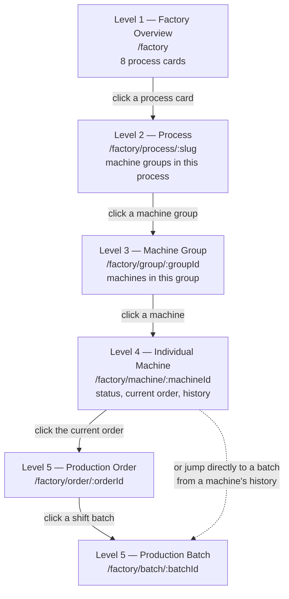

# 09 — Factory Live Drilldown

**Deliverable I.** The live dashboard: five drilldown levels, the eight Level 1 process cards, the
machine status model, the status colour tokens (defined once, reused everywhere), the data source
matrix for every live field, and the refresh model.

Related reading: [`14-kpi-dictionary.md`](14-kpi-dictionary.md) — no field on any card here is displayed
unless it resolves to a KPI defined there, or is explicitly marked as not displayed.
[`06-user-roles.md`](06-user-roles.md) for who may act at each level. [`08-screen-list.md`](08-screen-list.md)
for the routes and phase each screen ships in.

---

## 1. The five levels

| Level | Name | Shows | Route |
|---|---|---|---|
| 1 | Factory Overview | The eight process cards, factory-wide alerts | `/factory` |
| 2 | Process | Machine groups within one process | `/factory/process/:slug` |
| 3 | Machine Group | Machines within one group | `/factory/group/:groupId` |
| 4 | Individual Machine | One machine's status, current order, history | `/factory/machine/:machineId` |
| 5 | Production Order / Batch | One order and its constituent shift/machine batches | `/factory/order/:orderId`, `/factory/batch/:batchId` |

### Worked example: the full breadcrumb

`Factory > Fabric Production > Warp Knitting > WKM-24-03 > PO-2609-018 > Batch K-2026-15`

| Step | Level | Screen shows | Route in this example |
|---|---|---|---|
| `Factory` | 1 | The eight process cards; user clicks **Fabric Production** | `/factory` |
| `Fabric Production` | 2 | The machine groups that sit under Fabric Production (Warp Knitting, Jacquard, Needle Loom, Crochet); user clicks **Warp Knitting** | `/factory/process/fabric-production` |
| `Warp Knitting` | 3 | Every machine in the Warp Knitting group, each showing its status colour token; user clicks **WKM-24-03** | `/factory/group/warp-knitting` |
| `WKM-24-03` | 4 | This machine's current status, current order, running history, and (Phase 2) its live KPI counters; user clicks the order it is running | `/factory/machine/wkm-24-03` |
| `PO-2609-018` | 5a | The production order's detail — status timeline, Order Completion %, linked batches; user clicks today's batch | `/factory/order/po-2609-018` |
| `Batch K-2026-15` | 5b | One machine, one shift, one day's production entries, including any downtime logged against it | `/factory/batch/k-2026-15` |

> **`WKM-24-03` is an ILLUSTRATIVE machine ID only.** It is not a real Interconverters machine
> identifier. The relationship between the legacy `MACH NO 1–17` seen on IC-FM-01 and the "6 × 24-needle
> Warp Knitting Machines" referenced elsewhere in the brief is **not established** — they may be the
> same physical machines under two naming schemes, or two different populations. This mapping is a
> **BLOCKING `NEEDS CONFIRMATION`** item (see `11-needs-confirmation.md`): the machine master
> (`05-database-schema.md` §2) deliberately carries both `machine_id` and `legacy_machine_no` as
> separate fields precisely so this question does not have to be pre-answered to design the schema. No
> screen in this pack assumes `WKM-24-01…06` and `MACH NO 1–17` are the same or different — that
> decision is left to Interconverters.

---

## 2. The eight process cards (Level 1)

Each card is large, clickable, and represents one stage of the factory's flow from raw material to
finished goods. Clicking a card navigates to its Level 2 Process screen.

| # | Process card | Slug (`:slug`) | Corresponding machine group(s) | Corresponding module |
|---|---|---|---|---|
| 1 | Raw Material | `raw-material` | *(none — a stock view, not a machine group)* | M5 Stock & Lots |
| 2 | Warping | `warping` | Warping | M6 Production & Factory Live |
| 3 | Fabric Production | `fabric-production` | Warp Knitting, Jacquard, Needle Loom, Crochet | M6 Production & Factory Live |
| 4 | Winding | `winding` | Cone Winding | M6 Production & Factory Live |
| 5 | Quality Control | `quality-control` | *(none — an inspection process, not a machine group)* | M7 Quality Control |
| 6 | Press / Finishing | `press-finishing` | Press/Finishing | M6 Production & Factory Live |
| 7 | Packing | `packing` | Packing | M8 Packing & Finished Goods |
| 8 | Finished Goods | `finished-goods` | *(none — a stock view, not a machine group)* | M8 Packing & Finished Goods |

Fabric Production aggregates four machine groups because the paper evidence does not distinguish which
of Interconverters' knitting technologies produced which row on IC-FM-01 — `MACH NO` alone does not say
whether a machine is Warp Knitting, Jacquard, Needle Loom or Crochet. That association is part of the
same machine-mapping question flagged above.

---

## 3. Process card specification

**CRITICAL RULE:** a KPI may **not** be displayed on a process card until its formula is formally
defined in [`14-kpi-dictionary.md`](14-kpi-dictionary.md). Every field below either names the KPI it
resolves to, or is marked `NOT DISPLAYED — formula undefined`. Fields that are plain counts of the
Machine Status Model (§4 below) rather than one of the 15 dictionary KPIs are labelled as such — they
are gated by that model being defined in this document, not by the KPI dictionary, since they are not
rates or ratios.

| Card field | Resolves to | V1 status |
|---|---|---|
| **Process Status** | Not a KPI — a business-rule rollup of the machine status counts below (§4): `Running` if ≥1 machine is Running; else `Setup` if ≥1 is in Setup; else `Down` if all assigned machines are Down; else `Idle` | **Displayed.** Derivation is defined in this document (§4), no KPI dictionary entry required |
| **Running Machines** | Not a KPI — `COUNT` of machines in this process/group with status `Running` | **Displayed.** Direct tally against the Machine Status Model |
| **Idle Machines** | Not a KPI — `COUNT` with status `Idle` | **Displayed** |
| **Setup Machines** | Not a KPI — `COUNT` with status `Setup` | **Displayed** |
| **Down Machines** | Not a KPI — `COUNT` with status `Down` | **Displayed** |
| **Maintenance Machines** | Not a KPI — `COUNT` with status `Maintenance` | **Displayed** |
| **Current Orders** | Not a KPI — `COUNT` of `production_orders` in an active status assigned to this process/group | **Displayed** |
| **Target Output** | KPI: **Target Production** | **NOT DISPLAYED IN V1** — the KPI is named, but no data source captures a target on any current form (`14-kpi-dictionary.md` KPI 2). Field is hidden, not shown as zero |
| **Actual Output** | KPI: **Production Quantity** | **Displayed.** Computable in V1 (verified `TOTAL METER`/`PER MACHINE KG` formulas) |
| **Efficiency** | KPI: **Machine Efficiency %** | **NOT DISPLAYED — formula undefined for V1.** Defined in the dictionary, but blocked by the unresolved `machine speed` unit and the absent Target Production (`14-kpi-dictionary.md` KPI 5) |
| **Downtime** | KPI: **Downtime Minutes** | **Displayed**, conditional on operators logging start/stop consistently via the new Production Entry screen — see `14-kpi-dictionary.md` KPI 6 |
| **Alerts** | Not a single KPI — a rule engine over the Machine Status Model, Downtime Minutes, and order due dates | **Partially displayed.** Individual alert rules are shown only if their underlying trigger is itself displayable: e.g. a "Machine Down" alert is shown (built on the Machine Status Model, no KPI needed); an "Efficiency below threshold" alert is **not** shown (built on Machine Efficiency %, which is undefined in V1) |

No card in V1 shows Target Output or Efficiency. This is a direct, visible consequence of the KPI gate,
not an oversight.

---

## 4. Machine status model

Six mutually exclusive states, applied at Level 3 (Machine Group), Level 4 (Individual Machine), and
rolled up into the Level 1/2 process-card counts:

| State | Meaning |
|---|---|
| **Running** | Machine is actively producing against an assigned order |
| **Idle** | Machine is available but has no order assigned, or is between orders |
| **Setup** | Machine is being prepared for a run — threading, article change (matches the observed `Article Change` remark on IC-FM-01) |
| **Down** | Machine has stopped unexpectedly — breakdown, fault |
| **Maintenance** | Machine is stopped for planned or corrective maintenance work |
| **Offline** | Machine is not in active use at all — decommissioned, mothballed, or not yet commissioned |

---

## 5. Status colour tokens

Defined **once**, here, as semantic design tokens. Every Factory Live screen that shows machine or
process status must reuse these tokens — **never redefine a status colour locally on an individual
screen.** Both light and dark theme keep the same semantic meaning; only the underlying colour value may
shift for contrast, the mapping of status → hue never does.

| Status | Colour | Token name |
|---|---|---|
| Running | Green | `--status-running` |
| Idle | Yellow | `--status-idle` |
| Setup | Orange | `--status-setup` |
| Down | Red | `--status-down` |
| Maintenance | Blue | `--status-maintenance` |
| Offline | Grey | `--status-offline` |

Process Status (the Level 1/2 card rollup, §3 above) reuses the **same six tokens** — a card whose
rollup resolves to `Down` is coloured with `--status-down`, identically to how an individual machine
showing `Down` is coloured at Level 3/4. There is exactly one colour vocabulary in the product, not one
per screen.

---

## 6. Data source matrix

Every live dashboard field, classified by where its value actually comes from. Categories: **MANUAL** |
**CALCULATED** | **STUDIO** | **FACTORY_DATABASE** | **QUICKBOOKS** | **IOT_SENSOR** | **PLC** |
**DERIVED**. The **V1** column states today's source; **Future** states where it moves once IoT/PLC
integration exists (Phase 5) — Factory Live is designed to accommodate that move without a schema
change, but nothing in Phase 5 is built in this pack.

### Worked examples (as specified)

| Field | V1 | Future |
|---|---|---|
| Machine Status | Manual | IoT-PLC |
| Production Meters | Manual meter reading | Pulse counter |
| Product Specification | Studio | Studio |
| Invoice Status | QuickBooks | QuickBooks |
| Downtime Minutes | Manual | Stop signal |
| Machine Speed | Manual | RPM sensor |

### Full matrix

| Field | Shown at | Classification | V1 source | Future source |
|---|---|---|---|---|
| Machine Status | Level 3, 4 | MANUAL → FACTORY_DATABASE | Operator/Supervisor sets status via Machine Detail | IoT/PLC state signal |
| Running / Idle / Setup / Down / Maintenance counts | Level 1, 2, 3 | CALCULATED | `COUNT` over Machine Status (Manual V1) | Same calculation, over IoT-sourced status |
| Current Orders count | Level 1, 2 | FACTORY_DATABASE | `COUNT` of active `production_orders` | Unchanged |
| Production Meters (Actual Output) | Level 1–5 | MANUAL → FACTORY_DATABASE | Operator meter reading, Production Entry | Pulse counter |
| Production Kg | Level 1–5 | MANUAL → FACTORY_DATABASE | Operator kg reading, Production Entry | Load cell / pulse counter |
| Target Output | Level 1–5 | MANUAL (once built) | **Not captured — see `14-kpi-dictionary.md` KPI 2** | Planning-tool entry, unchanged classification |
| Efficiency | Level 1–4 | CALCULATED | **Undefined — see KPI 5** | Calculated once Ideal Rate and Target exist |
| Downtime Minutes | Level 1–5 | MANUAL → CALCULATED | Operator/Supervisor logs stop reason & duration | PLC stop signal |
| Downtime Reason | Level 4, 5 | MANUAL | Operator/Supervisor selects from `downtime_reasons` master | Still MANUAL — a PLC signal can flag *that* a stop occurred, not *why* |
| Machine Speed | Level 4 | MANUAL | Operator-entered (paper precedent: `machine speed = 400`, unit `NEEDS CONFIRMATION`) | RPM sensor |
| Product Specification | Level 4, 5 | STUDIO | Referenced from `design_projects`/`production_specs` by FK, never copied | Unchanged — Studio remains system of record |
| Order Quantity | Level 5 | STUDIO | Carried across at the `ORDER_CONFIRMED` handoff | Unchanged |
| Order Status | Level 5 | FACTORY_DATABASE | `production_orders.status`, the 21-state model | Unchanged |
| Order Completion % | Level 5 | CALCULATED | Production Quantity (Manual) ÷ Order Quantity (Studio) | Unchanged classification, faster refresh |
| Invoice Status | Level 5 (order detail) | QUICKBOOKS | Reference field synced from QuickBooks (`07-quickbooks-mapping.md`) | Unchanged — QuickBooks remains system of record |
| Stock Balance | Level 1 (Raw Material, Finished Goods cards) | CALCULATED → FACTORY_DATABASE | Running total over `stock_ledger` | Unchanged, possibly real-time on GRN/dispatch events |
| Operator Name | Level 4, 5 | FACTORY_DATABASE | Selected from `operators` master at entry | Unchanged |
| Shift | Level 4, 5 | FACTORY_DATABASE | Selected from `shifts` master at entry — **seeding blocked**, see §7 below | Unchanged |
| QC Result | Level 5, Quality Control card | MANUAL | Quality logs pass/hold via `/factory/qc` (Phase 3) | Possibly camera/vision-assisted inspection, still logged manually in V1 sense |
| Wastage | Level 4, 5 | MANUAL | Field exists on Production Entry (mirrors IC-FM-01's empty `WASTAGE` column) | Unchanged — recording practice itself is `NEEDS CONFIRMATION` |
| Alerts | Level 1, 2 | DERIVED | Rule engine over the fields above | Same rule engine, faster-refreshing inputs |
| Rolls Completed | Level 1 (Packing card), Level 5 | CALCULATED → MANUAL | Metres ÷ roll length (derived) | Physical count once Packing (Phase 3) live |

---

## 7. Refresh model

**V1 is manual entry feeding the dashboard.** Be honest about what "live" means here: it means **as
recently as the last production entry was keyed**, not a real-time telemetry feed. There is no
IoT/PLC layer in this pack — every Manual-classified field in the matrix above only updates when a
person opens a screen and types a value in.

- IC-FM-01 (the Daily Production Report, F5) is filled **per shift** today, and the observed shift
  length is **12 hours** (`SHIFT TIME` column, consistent on every sampled row). So the natural V1
  granularity of "live" is **per-shift** — a machine's dashboard figures will not move more often than
  once every 12 hours unless entry frequency changes.
- Whether Factory Live should ask operators to log more frequently than once per shift (e.g. hourly
  meter checkpoints) is a product decision with real shop-floor cost, and it is **not** assumed here.
  **`NEEDS CONFIRMATION`: target entry frequency.** Until Interconverters confirms an intended cadence,
  design the Production Entry screen to support at minimum the paper form's own per-shift discipline,
  and treat any higher frequency as an enhancement rather than a baseline requirement.
- The refresh model has a direct KPI consequence: any KPI computed from Manual-source fields (Production
  Quantity, Downtime Minutes, and everything built on them) inherits this same per-shift lag in V1,
  regardless of how fast the dashboard's own page-refresh is.

---

## Cross-references

- KPI formulas and computability: [`14-kpi-dictionary.md`](14-kpi-dictionary.md)
- Screens and routes for every level: [`08-screen-list.md`](08-screen-list.md)
- Roles authorised to change machine/order status: [`06-user-roles.md`](06-user-roles.md)
- The machine-mapping and shift-mapping open questions: [`11-needs-confirmation.md`](11-needs-confirmation.md)
- Machine master fields (`machine_id`, `legacy_machine_no`, etc.): [`05-database-schema.md`](05-database-schema.md)
